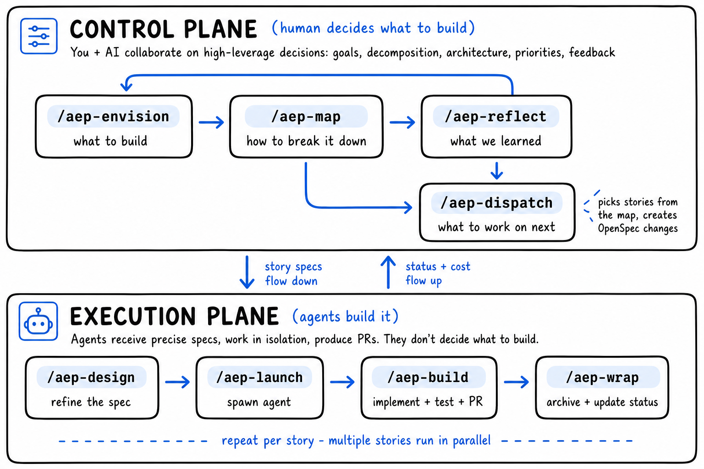
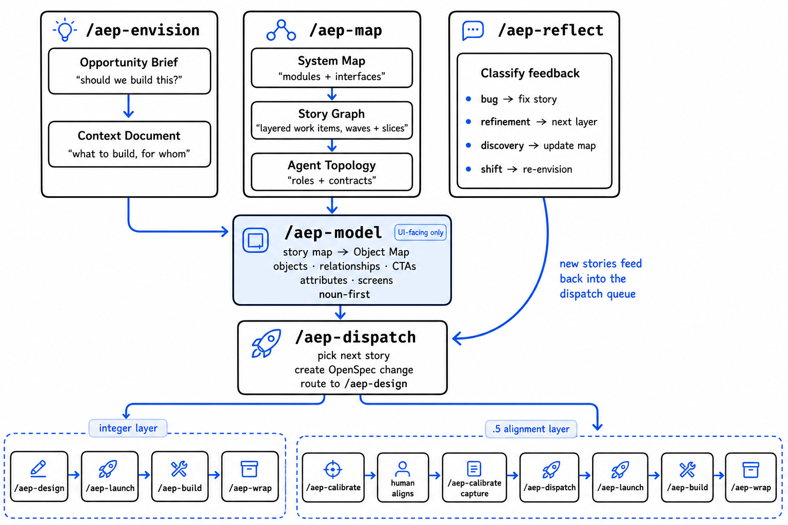

# Agentic Engineering Patterns

A Claude Code plugin for building software products with AI agents — from raw idea to shipped MVP.

## Why This Exists

Traditional software development bottlenecks on human coding time. Process design optimizes "how to make people write code faster."

When agents can execute dozens of tasks in parallel, that bottleneck vanishes. A new one takes its place:

> **Agent execution capacity is near-infinite. Specification quality is not.**

Vague specs don't slow down a human — they ask a colleague and adjust. Vague specs paralyze agents — they guess, diverge, and produce incompatible code across parallel sessions. The cost of ambiguity scales with parallelism.

This inverts the entire design logic:

```
Traditional:    plan roughly → adjust as you go → ship
                (optimizes for human coding speed)

Agentic:        invest heavily in spec precision → parallel execution → ship
                (optimizes for agent execution quality)
```

Every skill in this plugin serves that logic. The time you spend in `/aep-envision` and `/aep-map` pays back exponentially when agents build in parallel without asking questions.

## Installing Skills

AEP skills follow the open [Agent Skills](https://agentskills.io/) format, so any project — under
Claude Code, Codex, Cursor, OpenCode, and [70+ other agents](https://github.com/vercel-labs/skills#supported-agents) —
can install them with the [`skills`](https://github.com/vercel-labs/skills) CLI. No clone, no copied scripts.

### Agent prompt

Prefer to delegate the install? Paste this to your coding agent — it covers the AEP skills, the
required OpenSpec CLI, the formatter fix, and wiring AEP into your `AGENTS.md` / `CLAUDE.md`:

```text
Install the Agentic Engineering Patterns (AEP) skills into this project, pinned to the latest release.

1. Install the latest release for each agent this repo uses — find the newest tag at
   https://github.com/memorysaver/agentic-engineering-patterns/releases/latest, then run once per agent:
     npx skills add memorysaver/agentic-engineering-patterns@<latest-tag> -a claude-code --skill '*' -y
     npx skills add memorysaver/agentic-engineering-patterns@<latest-tag> -a codex        --skill '*' -y
   This writes the skills under .claude/skills/ and/or .agents/skills/ plus a skills-lock.json manifest.

2. Commit the installed skill files together with skills-lock.json. The lockfile pins content
   hashes, not the git tag, so the committed files are what durably lock that release — after that,
   teammates and CI need no install step.

3. If this repo auto-formats Markdown/JSON on commit (Prettier, oxfmt, Biome, dprint, a
   lefthook/husky hook): exclude .claude/skills/**, .agents/skills/**, and skills-lock.json from
   the formatter, then make the install commit with --no-verify. Otherwise reformatting rewrites
   the skill files and breaks the lockfile hashes.

4. Add a short section to AGENTS.md (and/or CLAUDE.md) so the workflow is discoverable:
     ## AEP Workflow
     This project uses the Agentic Engineering Patterns (AEP) skills — a spec-driven, multi-agent
     feature lifecycle in .claude/skills/ and/or .agents/skills/, pinned via skills-lock.json.
     The skills are self-describing; start with `aep-onboard`. Upgrade by re-running
     `npx skills add memorysaver/agentic-engineering-patterns@<newtag>` once per agent.

5. Verify with `npx skills list`. Restore from the lockfile later with `npx skills experimental_install`.

6. REQUIRED — install the OpenSpec CLI. AEP is a spec-driven workflow: its skills (/aep-scaffold,
   /aep-dispatch, /aep-design, /aep-build, /aep-wrap) shell out to `openspec`, so it must be on PATH. Install it
   globally (needs Node >= 20.19), then verify:
     npm install -g @fission-ai/openspec@latest
     openspec --version
   AEP creates the per-project openspec/ artifacts itself — /aep-scaffold initializes them for a new
   project, or run `openspec init` once in an existing repo.

7. Then ALWAYS ASK the user which optional add-ons they want — both come from
   memorysaver/skills (newest tag at https://github.com/memorysaver/skills/releases/latest):
     a. "Set up behavioral guidelines (a coding-discipline preamble) in AGENTS.md?"
        If yes → install `project-behavior`, then run it to scaffold/extend AGENTS.md.
     b. "Set up a project memory system (committed lessons + recall)?"
        If yes → install `project-memory` (and `memory-forge`), run project-memory to bootstrap
        project-memory/, then add a concise "## Memory & Learning Loop" section to AGENTS.md that
        LAYERS these onto AEP's native lessons loop — don't duplicate it. (AEP already captures
        via /aep-build -> .dev-workflow/lessons.md, archives via /aep-wrap -> lessons-learned/, and
        recalls via /aep-launch.) Keep it to a few lines; the skills are self-describing:
          - project-memory — recall at /aep-dispatch, and at /aep-wrap persist the just-archived lesson
            into project-memory/ for qmd-backed semantic recall.
          - memory-forge — at /aep-reflect or before a PR, distill settled lessons (>=7 days, once
            >=3 have accrued) into reusable skills the next agent auto-loads.
   Install each chosen skill once per agent, then commit the installed files (the commit is the pin):
     npx skills add memorysaver/skills@<latest-tag> -a claude-code --skill project-behavior -y
```

### Quick start

> **Always name your agent with `-a`.** The CLI's auto-detect (and `--all` / `--agent '*'`)
> installs into the cross-agent `.agents/skills/` directory — which **Claude Code does not read**
> (Claude Code only loads `.claude/skills/`). Passing `-a claude-code` is what makes the install
> land where Claude Code will find it.

```bash
# Claude Code — installs all AEP skills into ./.claude/skills/ at project level
npx skills add memorysaver/agentic-engineering-patterns -a claude-code --skill '*'
```

Skills install with the `aep-` prefix (e.g. `aep-map`, `aep-build`) at **project level** — committed
with your repo and shared with your team — and each skill is **self-contained**, so its shared
templates and references travel with it.

### Multiple runtimes (run once per agent)

`-a` takes a single agent: a repeated `-a a -a b` keeps only the last, and a comma list
(`-a a,b`) installs nothing. To cover several runtimes, run the command once per agent:

```bash
npx skills add memorysaver/agentic-engineering-patterns -a claude-code --skill '*'   # → ./.claude/skills/
npx skills add memorysaver/agentic-engineering-patterns -a codex      --skill '*'    # → ./.agents/skills/
```

### Pinning a version

Append `@<git-ref>` (a release tag, branch, or commit) to lock what you install:

```bash
npx skills add memorysaver/agentic-engineering-patterns@v1.2.0 -a claude-code --skill '*'
```

One caveat worth knowing: `skills-lock.json` records each skill's **content hash**, not the git
tag. The lockfile alone therefore does **not** durably pin the version — `npx skills experimental_install`
restores from the source repo's **default branch**, which only matches the lock while that branch
still equals the locked content. To truly freeze a release, **commit the installed skill files**
(under `.claude/skills/` and/or `.agents/skills/`) together with `skills-lock.json`. The committed
bytes become the pin: teammates, CI, and Codex need no install step, and nothing drifts when
upstream moves on. Upgrade deliberately by re-running `add@<newtag>` in its own PR.

### Upgrading to a new release

Upgrading is a deliberate **re-pin in its own PR** — never an in-place mutation. Re-run the
install at the new tag once per agent the repo uses, then commit the changed skill files and
`skills-lock.json` together:

```bash
# Newest tag: https://github.com/memorysaver/agentic-engineering-patterns/releases/latest
npx skills add memorysaver/agentic-engineering-patterns@<newtag> -a claude-code --skill '*' -y
npx skills add memorysaver/agentic-engineering-patterns@<newtag> -a codex        --skill '*' -y
```

Then:

1. **Review the diff.** `git status` should show updated bytes under `.claude/skills/` and/or
   `.agents/skills/`, brand-new files for any skills the release added (e.g. a new `aep-watch/`),
   and rewritten hashes in `skills-lock.json`. Jumping several releases at once also backfills any
   files your old pin predated — expect more new files than the changelog's headline.
2. **Normalize `.claude/skills/aep-*` back to symlinks** if your layout shares one copy between
   runtimes (see the gotcha below).
3. **Bump the AGENTS.md pin note.** If your `AGENTS.md` states the pinned version in prose — the
   canonical header's `… pinned at **vX.Y.Z**) are self-describing …` line — update it to the new
   tag so the doc doesn't drift from the installed bytes. It's hand-written, so the skill install
   won't touch it. Stage it in the **same commit** as the skill bytes.
4. **Commit with `--no-verify`** so the pre-commit formatter doesn't rewrite the pinned bytes and
   break the lockfile hashes (see [Keep your formatter off the skills](#keep-your-formatter-off-the-skills)).
5. **Verify.** `npx skills list` shows the new versions, the AGENTS.md pin note matches the new tag,
   and `git status` is clean.

> **Gotcha — the `-a claude-code` symlink copy.** If your canonical layout keeps
> `.agents/skills/<name>` as the **real files** and `.claude/skills/<name>` as a **symlink** →
> `../../.agents/skills/<name>` (so both runtimes share one copy), then `npx skills add -a claude-code`
> **replaces those symlinks with copied real directories.** `git status` then shows the tracked
> symlinks as **deleted** plus a pile of untracked files — a spurious, layout-breaking diff. Run the
> `-a codex` install (which writes the real `.agents/` files) as well, then normalize the Claude side
> back to symlinks before committing:
>
> ```bash
> cd .claude/skills
> for d in aep-*; do
>   [ -L "$d" ] || { rm -rf "$d" && ln -s "../../.agents/skills/$d" "$d"; }
> done
> ```
>
> Afterward `git status` shows only the real `.agents/skills/**` updates (no phantom deletions) and
> both runtimes resolve to one set of bytes again. Repos that install real copies for each agent
> (no symlinks) can skip this step.

### Optional supplement: behavior + memory

Two project-level capabilities AEP doesn't ship itself live in a separate repo,
[`memorysaver/skills`](https://github.com/memorysaver/skills). Install them as an
**optional supplement** — once per agent (`-a claude-code`, then `-a codex`):

```bash
npx skills add memorysaver/skills@<latest-tag> -a claude-code \
  --skill project-behavior --skill project-memory --skill memory-forge
```

- **`project-behavior`** — scaffolds/extends your `AGENTS.md` with a behavioral preamble
  (a Karpathy coding-discipline pack by default); run it after installing.
- **`project-memory`** — a git-committable `project-memory/` store with qmd-backed semantic recall;
  run it to set up, then add a concise `## Memory & Learning Loop` section to `AGENTS.md` that
  **layers** it onto AEP's native lessons loop (recall at `/aep-dispatch`, persist at `/aep-wrap`) rather
  than running a parallel one.
- **`memory-forge`** — distills settled `project-memory/` lessons (>=7 days) into reusable skills at
  `/aep-reflect` or before a PR — the distillation step AEP's native loop doesn't have.

These aren't part of AEP's versioned release — pin them the same way you pin AEP: install the
latest [`memorysaver/skills`](https://github.com/memorysaver/skills/releases/latest) release
tag, then **commit the installed files** to freeze it.

### Keep your formatter off the skills

Skill files are Markdown and JSON. If your repo auto-formats those on commit (Prettier, oxfmt,
Biome, dprint, a lefthook / husky hook…), it will rewrite the installed skills and **break the
content hashes in `skills-lock.json`**. Exclude the skill paths from your formatter —
`.claude/skills/**`, `.agents/skills/**`, and `skills-lock.json` — and make the install commit
with `--no-verify` so the pinned bytes stay byte-for-byte intact.

### Common commands

```bash
# List what's available before installing
npx skills add memorysaver/agentic-engineering-patterns --list

# Install specific skills (repeat --skill; use the aep- name)
npx skills add memorysaver/agentic-engineering-patterns -a claude-code --skill aep-map --skill aep-build

# Install globally (user-level, ~/.claude/skills) instead of project level
npx skills add memorysaver/agentic-engineering-patterns -a claude-code -g --skill '*'

# Copy files instead of symlinking (when symlinks aren't supported)
npx skills add memorysaver/agentic-engineering-patterns -a claude-code --skill '*' --copy

# Update / remove / list installed
npx skills update
npx skills remove aep-map
npx skills list

# Restore installed skills from skills-lock.json (e.g. after a fresh clone)
npx skills experimental_install
```

### Skill groups → skill names

The `skills` CLI selects by skill name (there's no "group" flag). The groups map to these `--skill` names:

| Group                                       | `--skill` names                                                                                        |
| ------------------------------------------- | ------------------------------------------------------------------------------------------------------ |
| **Workflow** (agentic-development-workflow) | `aep-design`, `aep-launch`, `aep-build`, `aep-wrap`, `aep-git-ref`                                     |
| **Product** (product-context)               | `aep-envision`, `aep-map`, `aep-model`, `aep-dispatch`, `aep-validate`, `aep-calibrate`, `aep-reflect` |
| **Setup** (project-setup)                   | `aep-onboard`, `aep-scaffold`, `aep-testing-guide`                                                     |
| **Patterns** (patterns)                     | `aep-gen-eval`, `aep-executor`, `aep-autopilot`, `aep-workflow-feedback`                               |

### Maintainer (legacy) workflow

The bespoke scripts remain for the maintainer's own multi-project workflow — they predate the
`skills` CLI and cover a few things it doesn't: **group-as-a-unit** installs, `--dry-run`,
exact orphan `--prune`, and **batch push to many registered projects** at once.

```bash
# Pull into one project (group filter, dry-run, prune all supported)
AEP_REPO=~/agentic-engineering-patterns bash scripts/sync.sh workflow --dry-run

# Push to every project registered in .aep/config.yaml (gitignored, machine-local)
bash scripts/sync-downstream.sh --init   # one-time: create the config
bash scripts/sync-downstream.sh          # push to all
bash scripts/sync-downstream.sh 91app    # push to one (name match)
```

For everyone else, `npx skills add` above is the supported path.

> **Releasing:** bumping `metadata.version` in `.claude-plugin/marketplace.json` must come with a matching [CHANGELOG.md](CHANGELOG.md) entry in the same PR (move the `[Unreleased]` notes under the new `[X.Y.Z] - DATE` heading), and a `vX.Y.Z` git tag on merge to `main`.

### Contributing skills (shared resources)

Skills are authored under `skills/<group>/<name>/SKILL.md` and must be **self-contained** so each
installs cleanly on its own. Resources shared across the product-context skills live once in
`skills/product-context/_shared/{references,templates}/`. A build step materializes them into each
skill that references them (those copies are marked with a `.aep-generated` file — don't edit them
by hand):

```bash
bun run skills:build    # edit _shared/, then regenerate the per-skill copies
bun run skills:check    # verify the copies are in sync (also runs in CI + pre-commit)
```

## The Mental Model

The workflow separates **thinking** from **doing**:



> This is the conceptual split. The control plane also has **specialized steps** this view omits — `/aep-model` (noun-first Object Map, UI-facing only), `/aep-calibrate` (human alignment on `.5` layers), `/aep-validate`, and `/aep-watch`. They appear in the detailed [Product Context](#1-product-context--the-persistent-map) flow below.

**Agents don't talk to each other.** They communicate through structured artifacts — context documents, story specs, interface contracts, signal files. The harness coordinates everything. This is a production system design, not a chatroom-style agent swarm.

## The Story Map

AEP organizes all work as a [Jeff Patton story map](https://www.jpattonassociates.com/user-story-mapping/). Read left-to-right for the user journey, top-to-bottom for enrichment. Every AEP term maps to a position on this structure:

```
                            ACTIVITY BACKBONE (extracted by /aep-envision)
    ─────────────────────────────────────────────────────────────────────────────►
    "The user authenticates, then configures, then monitors, then reviews"

    ┌──────────────┐  ┌──────────────┐  ┌──────────────┐  ┌──────────────┐
    │  Authenticate │  │  Configure   │  │   Monitor    │  │    Review    │
    │  (activity)   │  │  (activity)  │  │  (activity)  │  │  (activity)  │
    └──────┬───────┘  └──────┬───────┘  └──────┬───────┘  └──────┬───────┘
           │                 │                 │                 │
═══════════╪═════════════════╪═════════════════╪═════════════════╪══════════════
 Layer 0   │  WALKING SKELETON — thinnest end-to-end path       │
           │                 │                 │                 │
  Wave 1   │  ┌────────┐    │  ┌────────┐     │  ┌────────┐    │
           │  │ STORY  │    │  │ STORY  │     │  │ STORY  │    │
           │  │ db-    │    │  │ api-   │     │  │ web-   │    │
           │  │ setup  │    │  │ scaff  │     │  │ scaff  │    │
           │  │   S ◆  │    │  │   S    │     │  │   S    │    │
           │  └────────┘    │  └────────┘     │  └────────┘    │
           │                 │                 │                 │
  Wave 2   │  ┌────────┐    │  ┌────────┐     │                │  ┌────────┐
  (needs   │  │ STORY  │    │  │ STORY  │     │                │  │ STORY  │
   wave 1) │  │ auth-  │    │  │ config │     │                │  │ audit- │
           │  │ setup  │    │  │ basic  │     │                │  │ list   │
           │  │   M    │    │  │   S    │     │                │  │   M    │
           │  └────────┘    │  └────────┘     │                │  └────────┘
           │                 │                 │                 │
 ─ ─ ─ ─ ─│─ ─ LAYER GATE ─ "user can complete full journey" ─ │─ ─ ─ ─ ─ ─
           │                 │                 │                 │
═══════════╪═════════════════╪═════════════════╪═════════════════╪══════════════
 Layer 0.5 │  ALIGNMENT LAYER — human calibrates quality        │
           │                 │                 │                 │
  Wave 1   │  ┌────────┐    │                 │  ┌────────┐    │  ┌────────┐
  (visual- │  │ STORY  │    │                 │  │ STORY  │    │  │ STORY  │
   design) │  │ landing│    │                 │  │ dash-  │    │  │ auth-  │
           │  │ polish │    │                 │  │ board  │    │  │ pages  │
           │  │  M ✦   │    │                 │  │  M ✦   │    │  │  S ✦   │
           │  └────────┘    │                 │  └────────┘    │  └────────┘
           │                 │                 │                 │
           │  ✦ = calibration_type: visual-design               │
           │      dispatched with calibration/visual-design.yaml │
           │                 │                 │                 │
 ─ ─ ─ ─ ─│─ ─ RELEASE LINE ─ Layer 0 + 0.5 = first release ─ │─ ─ ─ ─ ─ ─
           │                 │                 │                 │
═══════════╪═════════════════╪═════════════════╪═════════════════╪══════════════
 Layer 1   │  CORE FEATURES — deeper capabilities               │
           │                 │                 │                 │
  Wave 1   │  ┌────────┐    │  ┌────────┐     │  ┌────────┐    │  ┌────────┐
           │  │ STORY  │    │  │ STORY  │     │  │ STORY  │    │  │ STORY  │
           │  │ oauth  │    │  │ guard- │     │  │ live-  │    │  │ audit- │
           │  │ provid │    │  │ rails  │     │  │ status │    │  │ detail │
           │  │   L    │    │  │   M    │     │  │   M    │    │  │   L    │
           │  └────────┘    │  └────────┘     │  └────────┘    │  └────────┘
           │                 │                 │                 │
  Wave 2   │                │  ┌────────┐     │  ┌────────┐    │
           │                │  │ STORY  │     │  │ STORY  │    │
           │                │  │ rule-  │     │  │ alert- │    │
           │                │  │ engine │     │  │ system │    │
           │                │  │   L    │     │  │   M    │    │
           │                │  └────────┘     │  └────────┘    │
           │                 │                 │                 │
 ─ ─ ─ ─ ─│─ ─ LAYER GATE ─ ─ ─ ─ ─ ─ ─ ─ ─ ─ ─ ─ ─ ─ ─ ─ ─ │─ ─ ─ ─ ─ ─
           │                 │                 │                 │
═══════════╪═════════════════╪═════════════════╪═════════════════╪══════════════
 Layer 1.5 │  ALIGNMENT LAYER — multiple calibration types      │
           │                 │                 │                 │
           │  ┌──────────────────────────────────────────────┐  │
           │  │ ✦ visual-design (extension — new patterns)   │  │
           │  │ ✦ copy-tone    (establishment — brand voice) │  │
           │  │ ✦ api-surface  (light — inline YAML update)  │  │
           │  └──────────────────────────────────────────────┘  │
           │                 │                 │                 │
 ─ ─ ─ ─ ─│─ ─ RELEASE LINE ─ Layer 1 + 1.5 = second release ─│─ ─ ─ ─ ─ ─
           │                 │                 │                 │
           ▼                 ▼                 ▼                 ▼
```

```
LEGEND

  STRUCTURE                           EXECUTION
  Activity    = column (user verb)    Wave      = parallel batch (← →)
  Layer       = row (enrichment)      Story     = atomic work unit (one PR)
  Layer Gate  = integration test      Dispatch  = pick + lock + launch

  ALIGNMENT                           SYMBOLS
  .5 Layer    = human checkpoint      ◆  critical path story
  Calibration = capture "right"       ✦  calibrated story
  Quality Dim = what to calibrate     S/M/L  complexity

  SKILLS                              READING ORDER
  /aep-envision  → activities + layers    left → right  = user journey
  /aep-map       → stories + waves        top → down    = enrichment
  /aep-calibrate → alignment decisions    ═══           = layer boundary
  /aep-dispatch  → scores + launches      ─ ─           = gate / release line
  /aep-reflect   → feedback → right phase
```

## The Plugins

Each plugin implements one layer of the mental model.

### 1. Product Context — the persistent map

Captures the "what and why" of the entire product in a single `product-context.yaml` — committed to git, versioned, and machine-parseable.



All sections live in one `product-context.yaml` file — opportunity, product, architecture, stories (with state machine), topology, layer gates, cost tracking, and a semantic changelog.

> **`/aep-model` is UI-facing only** (the noun-first **Object Map** step shown above). It auto-drafts from the story map, takes a short human approval, then governs object structure — so build agents stop inventing one-step-one-screen task-wizard UIs. Stored under `product/` (`object-model.yaml` + `maps/<capability>/object-map.yaml`), gated by dispatch/launch. Background: [docs/research/ooux-object-modeling.md](docs/research/ooux-object-modeling.md).

**Why this exists:** Without a product-level map, each feature is designed in isolation. Agents build incompatible pieces. Module boundaries are implicit. The YAML makes the whole system visible, machine-readable, and git-versioned before any code is written.

### 2. Feature Lifecycle — the execution cycle

Takes one story from the map and turns it into a merged PR. `/aep-dispatch` picks the story; the two-session model executes it:

```
MAIN SESSION (you + AI)                WORKSPACE SESSION (agent alone)
━━━━━━━━━━━━━━━━━━━━━━                ━━━━━━━━━━━━━━━━━━━━━━━━━━━━━━

/aep-dispatch
  pick story from YAML
  create OpenSpec change
         │
/aep-design
  refine the spec
  (or skip if well-specified) ────►   /aep-build
         │                              init tracking, read tasks.md
/aep-launch                                 implement each task linearly
  create git worktree                   (one git commit per task)
  on feat/<name> branch                 code review (+ evaluator loop)
  bootstrap agent             ◄────     create PR, handle review
  optional: spawn evaluator             merge (squash + delete branch)
         │                                     │
/aep-wrap    ◄─────────────────────────────────────┘
  archive OpenSpec change
  update story status in YAML
  remove worktree + branch
  check layer gate
  suggest /aep-reflect
```

**Why two sessions:** Design needs human judgment — you decide direction, scope, tradeoffs. Implementation is mechanical — the agent follows the spec, implements, tests, publishes. Separating them lets the agent work autonomously for hours while you do other things.

**Why git + worktree:** `git worktree add -b feat/<name>` gives each agent an isolated working tree on its own branch, sharing `.git/objects` so history isn't duplicated. Linear commits (one per `tasks.md` row) make the PR's commit list a readable table of contents. Squash-merge keeps `main`'s history clean. AEP previously used Jujutsu (jj); see [docs/decisions/migrate-from-jj-to-git.md](docs/decisions/migrate-from-jj-to-git.md) for why we switched.

#### Launch modes — native-first executor backends

`/aep-launch` doesn't hardwire one runtime. It detects the host through the
**executor abstraction** (`aep-executor`) and spawns the workspace agent with
the host's _native_ parallel-agent machinery — tmux+cmux survives only as an
explicitly-pinned legacy mode. Every mode satisfies the same invariants: one
story = one context window + one AEP-created worktree at
`.feature-workspaces/<name>` + one `.dev-workflow/` plan dir, with file-based
signals as the source of truth.

| Mode               | Host / mechanism                                                | Lifetime      | Mid-flight steering                 | Watch it via                    |
| ------------------ | --------------------------------------------------------------- | ------------- | ----------------------------------- | ------------------------------- |
| **claude-team**    | Claude Code agent teams — one teammate per story, standing team | session-bound | `SendMessage` (push)                | teammate pane / `Shift+Down`    |
| **claude-bg**      | Claude Code native background sessions (`claude --bg`)          | OS-bound      | `feedback.md` (pull) + stop/respawn | `claude attach` / `claude logs` |
| **codex-subagent** | Codex multi_agent (desktop app + CLI), `aep-builder` role       | session-bound | `send_input` (push)                 | thread list / `/agent`          |
| **codex-exec**     | headless `codex exec --cd <worktree>` workers                   | OS-bound      | `codex exec resume <id>`            | signals + PR                    |
| **workflow**       | Claude Code dynamic-workflow fan-out (one agent per story)      | session-bound | stage boundaries + gates only       | `/workflows` view + signals     |
| **legacy**         | tmux session (+ optional cmux tab) — pin or generic-host only   | OS-bound      | `tmux send-keys`                    | cmux tab / `tmux attach`        |

Selection is automatic and native-first (teams flag → `claude-team`; otherwise
`claude-bg`; Codex main thread → `codex-subagent`; cron-driven → `codex-exec`).
The two manual levers: `git config aep.executor-backend tmux` pins legacy, and
"…with workflow" opts into the batch fan-out. **Lifetime matters for
orchestration:** session-bound workers die with the orchestrator session, so
`/aep-autopilot` under a long-lived `/loop` can use any mode, while cron-driven
ticks need the OS-bound ones. Full detection/selection/recipes:
[`skills/patterns/executor/references/backends.md`](skills/patterns/executor/references/backends.md).

#### Human gates — hub-and-spoke, two styles

A workspace agent that hits a decision only the human can make (design
ambiguity, eval non-convergence, manual QA) never guesses and never silently
stalls — it raises a **human gate**: append the question to
`.dev-workflow/signals/needs-human.md` and set `blocked_on: "human"` in
`status.json`. The **main agent is the canonical human console**
(hub-and-spoke): the question flows back to the orchestrator, you answer it
there, and the answer is relayed to the worker. You never _have_ to visit a
worker's surface — the per-mode panes/threads/attach are optional conveniences.
How the answer travels depends on the mode:

- **Block-in-place** (claude-team / codex-subagent / legacy): the worker waits
  in place; the answer arrives on the mode's push channel (`SendMessage` /
  `send_input` / tmux nudge).
- **Gate-and-park** (workflow / headless / codex-exec / claude-bg): no push
  channel reaches a running worker, so the worker **parks** — commits WIP,
  records the gate, and ends its run cleanly. The orchestrator collects the
  question, asks you, and **resumes a worker into the same worktree** with
  your answer. Parking is cheap because all worker state lives in the worktree
  - `.dev-workflow/`, never only in agent context.

Gate-and-park is what makes the **workflow** mode a complete backend rather
than fire-and-forget batch: each build agent returns a structured `gated`
result, the main agent asks you after the run, and gated stories resume in
their worktrees. Gated workspaces count as _waiting_ — not stuck, not failed.

### 3. Project Setup — the one-time foundation

Gets your machine and project ready. Run once.

```
/aep-onboard                             /aep-scaffold
    │                                    │
    ▼                                    ▼
Verify tools                         Scaffold monorepo
(bun, git, gh, claude,               (Better-T-Stack: frontend,
 openspec; tmux optional)             backend, database, auth,
                                      API layer, addons)
    │                                    │
    ▼                                    ▼
Install plugins                      Initialize OpenSpec
(superpowers, frontend-design,       (explore/propose/apply/archive
 mgrep; browser optional)            commands for spec-driven dev)
```

## The Feedback Loop

The workflow is a loop, not a line. After shipping features, `/aep-reflect` classifies what you learned:

```
                    ┌──────────────────────────────────┐
                    │                                  │
     ┌──────────── │ ◄── opportunity shift             │
     │              │      (back to /aep-envision)          │
     │              │                                  │
     │  ┌───────── │ ◄── discovery                     │
     │  │           │      (update /aep-envision or /aep-map)   │
     │  │           │                                  │
     │  │  ┌────── │ ◄── refinement                    │
     │  │  │        │      (new story in next layer)    │
     │  │  │        │                                  │
     │  │  │  ┌─── │ ◄── polish                        │
     │  │  │  │     │      (.5 layer → /aep-calibrate)      │
     │  │  │  │     │                                  │
     │  │  │  │  ┌─ │ ◄── bug                           │
     │  │  │  │  │  │      (fix story, back to /aep-design) │
     │  │  │  │  │  │                                  │
     │  │  │  │  │  │ ◄── process                       │
     │  │  │  │  │  │      (workflow improvement)       │
     │  │  │  │  │  │                                  │
     │  │  │  │  │  └──────────────────────────────────┘
     │  │  │  │  │           /aep-reflect
     ▼  ▼  ▼  ▼  ▼
  Each feedback type routes to the right phase.
  "Polish" is now "Calibration" — covers visual design,
  UX flow, API surface, data model, copy/tone, scope,
  and performance quality dimensions.
  The product context evolves. The cycle continues.
```

### Human Alignment Layers

Agents build to spec, but specs are lossy compressions of human intent. After each implementation layer, optional `.5` alignment layers let the human recalibrate what "right" means across any quality dimension:

```
Layer 0 (walking skeleton)
  → /aep-calibrate visual-design → human explores with design tools → capture
  → Layer 0.5 (alignment: implement with calibrated design context)
Layer 1 (core features)
  → /aep-calibrate api-surface   → 30-min conversation → updates product-context.yaml
  → /aep-calibrate copy-tone     → establish brand voice → calibration/copy-tone.yaml
  → Layer 1.5 (alignment: extend design system + apply voice)
```

The `/aep-calibrate` skill supports 7 dimensions — **visual-design**, **ux-flow**, **api-surface**, **data-model**, **scope-direction**, **copy-tone**, **performance-quality** — split into two classes:

- **Heavy** (visual-design, ux-flow, copy-tone): external exploration, standalone YAML artifacts in `calibration/`
- **Light** (api-surface, data-model, scope-direction, performance-quality): 30-60 min conversation, updates `product-context.yaml` directly

Quality dimensions are declared during `/aep-envision` and checked by `/aep-reflect` after each layer.

### Institutional Memory

Workspace agents capture what they learn during builds — solutions discovered, errors encountered, missing docs — in `.dev-workflow/lessons.md`. When `/aep-wrap` archives the workspace, substantive lessons are persisted to `lessons-learned/` at the repo root. `/aep-launch` injects relevant prior lessons into bootstrap prompts, so the next agent building in the same module doesn't start from zero.

## Design Principles

These aren't rules we invented — they're patterns extracted from Anthropic's engineering research on long-running agent harnesses:

**Spec precision over implementation speed.** Time invested in unambiguous specs pays back exponentially across parallel agents. A 10-minute conversation in `/aep-envision` saves hours of agent confusion.

**Walking skeleton first.** Build the thinnest end-to-end path (Layer 0) before going deep into any module. Validate the architecture at minimum cost. Going deep before proving the skeleton works is the most expensive mistake.

**Every harness component earns its place.** Sprint contracts, verification JSON, signal files, evaluator agents — each exists because of a specific failure mode observed in practice. As models improve, stress-test each component and remove what's no longer needed.

**Generator-evaluator separation.** Agents praise their own work even when it's mediocre. A separate evaluator agent, calibrated toward skepticism, catches problems the builder missed. This is the single most durable pattern from Anthropic's research.

## Getting Started

**Brand new to AEP?** Start with the [Orientation Guide](docs/orientation.md) for a 10-minute tour of the mental models, the 19 skills, and the four paths — then run `/aep-onboard`.

**New to this plugin?**

```
/aep-onboard
```

Installs prerequisites, verifies tools, configures recommended plugins, and walks you through the 5-minute mental-model orientation in Phase 0.

**Have a product idea?**

```
/aep-envision  →  /aep-map  →  /aep-scaffold
```

Validate the opportunity, decompose into stories, scaffold the project.

**Ready to build a feature?**

```
/aep-dispatch  →  /aep-design  →  /aep-launch  →  /aep-build  →  /aep-wrap
```

Pick a story from the map, spec it, spawn the agent, let it build, archive when merged.

**Want hands-free autonomous mode?**

```
/aep-autopilot
```

One command. Autopilot dispatches, launches, monitors, reviews, merges, and wraps — pausing only when human design input is needed.

**Shipped something? Close the loop:**

```
/aep-reflect
```

Classify feedback, update the product context, plan the next iteration.

**Something feels off? Calibrate:**

```
/aep-calibrate visual-design    → design brief → external tools → /aep-calibrate capture
/aep-calibrate api-surface      → conversation → updates product-context.yaml
/aep-calibrate scope-direction  → conversation → updates product-context.yaml
```

Generate a dimension-specific brief, explore or discuss, capture decisions for agents to follow.

## All Skills

| Skill            | Plugin                       | Purpose                                                                                                 |
| ---------------- | ---------------------------- | ------------------------------------------------------------------------------------------------------- |
| `/aep-envision`  | product-context              | Opportunity brief + context document                                                                    |
| `/aep-map`       | product-context              | System map + story graph + agent topology                                                               |
| `/aep-model`     | product-context              | Object-first UI structure (OOUX/ORCA Object Map) for UI products                                        |
| `/aep-dispatch`  | product-context              | Pick next story + create OpenSpec change                                                                |
| `/aep-calibrate` | product-context              | Human alignment checkpoint for any quality dimension                                                    |
| `/aep-reflect`   | product-context              | Classify feedback + update context                                                                      |
| `/aep-onboard`   | project-setup                | Verify tools + install plugins                                                                          |
| `/aep-scaffold`  | project-setup                | Scaffold monorepo + initialize OpenSpec                                                                 |
| `/aep-design`    | agentic-development-workflow | Explore + propose + review a feature                                                                    |
| `/aep-launch`    | agentic-development-workflow | Spawn workspace (Claude teams/bg sessions; Codex subagents/exec; tmux when pinned) + optional evaluator |
| `/aep-build`     | agentic-development-workflow | Implement → test → PR → merge                                                                           |
| `/aep-wrap`      | agentic-development-workflow | Archive + cleanup + suggest reflect                                                                     |
| `/aep-git-ref`   | agentic-development-workflow | AEP git + worktree conventions (on-demand)                                                              |
| `/aep-gen-eval`  | patterns                     | Generator/evaluator separation for honest validation                                                    |
| `/aep-executor`  | patterns                     | Host-agnostic backend for spawning/steering workspace agents                                            |
| `/aep-autopilot` | patterns                     | Autonomous dispatch-launch-monitor-wrap loop via `/loop`                                                |

Launches are **native-first** with **hub-and-spoke human gates** — see
[Launch modes](#launch-modes--native-first-executor-backends) and
[Human gates](#human-gates--hub-and-spoke-two-styles) in the Feature
Lifecycle section above for the full mode table and the
block-in-place / gate-and-park strategy.

## Documentation

- [Orientation Guide](docs/orientation.md) — 10-minute first-hour tour of mental models, skills, and the four paths (start here if you're new)
- [Glossary — Ubiquitous Language](docs/glossary.md) — precise definitions for every AEP term
- [Skills Quick Reference](docs/skills-quick-reference.md) — when to use which skill, decision trees, common sequences
- [Autonomous Loop](docs/autonomous-loop.md) — how `/aep-autopilot` orchestrates the full cycle
- [Generator/Evaluator Data Flow](docs/gen-eval-data-flow.md) — the three tracking systems and signal protocol
- [Release Line Adjustments](docs/release-line-adjustments.md) — when and how to re-slice layers
- [Design Calibration Workflow](docs/decisions/design-calibration-workflow.md) — the original visual-design `/aep-calibrate` skill
- [Generalized Calibration Workflow](docs/decisions/generalized-calibration-workflow.md) — multi-dimension `/aep-calibrate` and `.5` alignment layers
- [v2 Improvement Roadmap](docs/aep-v2-improvement-guideline.md) — capability maps, technical specs, dispatch enhancements

## Version History

Human-readable release notes for each version are in [CHANGELOG.md](CHANGELOG.md). The plugin version is the `metadata.version` field in `.claude-plugin/marketplace.json` and follows [Semantic Versioning](https://semver.org/).

## Inspired By

- [Harness Design for Long-Running Application Development](https://www.anthropic.com/engineering/harness-design-long-running-apps) — Anthropic Engineering
- [Effective Harnesses for Long-Running Agents](https://www.anthropic.com/engineering/effective-harnesses-for-long-running-agents) — Anthropic Engineering
- [Effective Context Engineering for AI Agents](https://www.anthropic.com/engineering/effective-context-engineering-for-ai-agents) — Anthropic Engineering
- [Better-T-Stack](https://www.better-t-stack.dev) — Full-stack TypeScript scaffold engine
- [OpenSpec](https://openspec.dev) — Spec-driven development CLI
- User Story Mapping — Jeff Patton (walking skeleton, layered delivery)

## License

MIT
