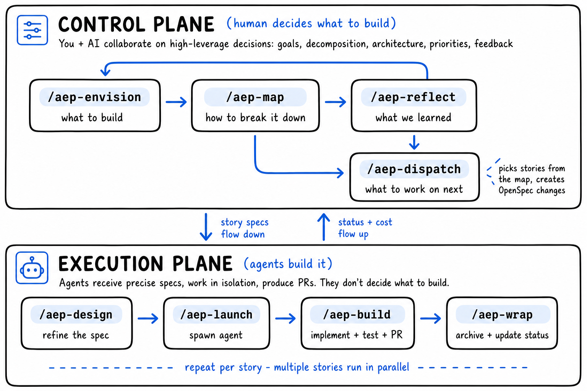
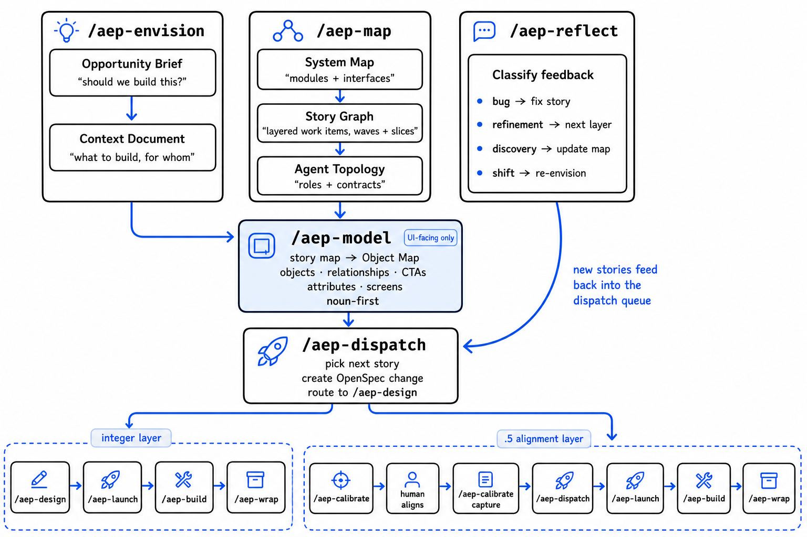

# Agentic Engineering Patterns

An Agent Skills workflow for building software with current-generation coding agents — from raw idea to verified delivery.

## Why This Exists

Traditional software development bottlenecks on human coding time. Process design optimizes "how to make people write code faster."

When agents can execute dozens of tasks in parallel, that bottleneck vanishes. A new one takes its place:

> **Agent execution capacity is near-infinite. Specification quality is not.**

Vague specs don't slow down a human — they ask a colleague and adjust. Vague specs paralyze agents — they guess, diverge, and produce incompatible code across parallel sessions. The cost of ambiguity scales with parallelism.

This inverts the entire design logic:

```
Traditional:    plan roughly → adjust as you go → ship
                (optimizes for human coding speed)

Agentic:        invest heavily in spec precision → parallel execution → ship
                (optimizes for agent execution quality)
```

Every skill in this plugin serves that logic. The time you spend in `/aep-envision` and `/aep-map` pays back exponentially when agents build in parallel without asking questions.

## Installing Skills

AEP skills follow the open [Agent Skills](https://agentskills.io/) format, so any project — under
Claude Code, Codex, Cursor, OpenCode, and [70+ other agents](https://github.com/vercel-labs/skills#supported-agents) —
can install them with the [`skills`](https://github.com/vercel-labs/skills) CLI. No clone, no copied scripts.

### Quick start — v4.1.0

Install AEP once for each agent runtime this project actually uses:

```bash
# Claude Code → ./.claude/skills/
npx -y skills@1.5.17 add memorysaver/agentic-engineering-patterns@v4.1.0 -a claude-code --skill '*' -y

# Codex → ./.agents/skills/
npx -y skills@1.5.17 add memorysaver/agentic-engineering-patterns@v4.1.0 -a codex --skill '*' -y
```

These are plain, project-level, per-agent installs — do not consolidate them into a shared or
canonical symlink layout. Commit the installed `aep-*` skill directories together with
`skills-lock.json`; those committed bytes are the durable pin for the project. Then run
`/aep-onboard` to verify OpenSpec, the executor, and the rest of the environment.

### Agent prompt

Prefer to delegate the install? Paste this to your coding agent — it covers the AEP skills, the
required OpenSpec CLI, the formatter fix, and wiring AEP into your `AGENTS.md` / `CLAUDE.md`:

```text
Set up Agentic Engineering Patterns (AEP) v4.1.0 completely in this repository. Perform the
work; do not stop at a plan or a list of commands. Preserve existing project configuration and
ask only when authentication, elevated privileges, or a destructive conflict blocks progress.

Baseline scope: AEP itself and its required tools. Do not install companion skill bundles,
external memory packages, or optional third-party plugins. Do not run /aep-scaffold or start
product work in this setup pass.

1. Inspect the repository before changing it:
   - Initialize git if this is a new, unversioned project directory.
   - Identify the current agent runtime, plus any other runtime already configured by this repo.
     Install for the current runtime at minimum; do not add an unused runtime.
   - Read existing AGENTS.md, CLAUDE.md, .claude/settings.json, formatter config, ignore files,
     package metadata, and git status. Preserve unrelated content and user changes.

2. Install v4.1.0 once for each runtime the repo actually uses. Keep plain per-agent copies:
     npx -y skills@1.5.17 add memorysaver/agentic-engineering-patterns@v4.1.0 -a claude-code --skill '*' -y
     npx -y skills@1.5.17 add memorysaver/agentic-engineering-patterns@v4.1.0 -a codex        --skill '*' -y
   Claude Code installs to .claude/skills/; Codex installs to .agents/skills/. The install also
   writes skills-lock.json. Never consolidate these directories into a shared symlink layout.

3. Find the installed aep-onboard/SKILL.md under the active runtime and follow it now. Phase 1 is
   already complete, so perform Phase 0 and the applicable work in Phases 2-5:
   - Install or repair required tools where safe. OpenSpec requires Node >= 20.19; install it with
       npm install -g @fission-ai/openspec@latest
     and verify `openspec --version`.
   - For a Claude Code install, also install and verify `jq`; AEP's concurrency hooks require it.
   - Treat Phase 3 tools as optional and report-only for this baseline.
   - For Claude Code, merge only AEP's concurrency hooks into .claude/settings.json. For a
     Codex-only repo, skip Claude settings. Preserve all existing settings and hooks.

4. Wire the agent instruction files from the installed aep-onboard templates (its Phase 1.5):
   AGENTS.md from templates/AGENTS.md.tmpl (it opens with the <!-- aep-agents-template --> marker
   and carries the working agreement plus the AEP Workflow section), CLAUDE.md = @AGENTS.md when
   Claude Code is installed, and Project-Convention/README.md from its template. If AGENTS.md
   already exists, apply aep-onboard references/migrations.md from its marker instead of
   overwriting it, and move project-specific content into Project-Convention/<topic>.md.

5. Protect the installed bytes. If Markdown/JSON formatting runs on commit (Prettier, oxfmt,
   Biome, dprint, lefthook, husky, or similar), add exact exclusions for .claude/skills/**,
   .agents/skills/**, and skills-lock.json while preserving the existing formatter policy.

6. Do not declare success until all applicable gates pass:
   - `npx -y skills@1.5.17 list --json -a <runtime>` reports all 24 AEP v4.1.0 skills for every installed runtime.
   - aep-onboard and aep-easy-explain exist under every installed runtime.
   - Node >=20.19, `openspec --version`, `git --version`, and at least one of `claude --version`
     or `codex --version` succeed; `jq` succeeds for Claude Code; all other required
     /aep-onboard Phase 5 checks pass.
   - AGENTS.md opens with the template marker and exposes the AEP Workflow section, CLAUDE.md is
     @AGENTS.md where Claude Code is installed, Project-Convention/README.md exists, formatter
     exclusions are present when needed, and no companion skill or external memory package was added.

7. After verification, stage only the AEP setup files and commit them together. Use --no-verify
   only when a formatter hook would rewrite the pinned skill bytes. Do not include unrelated
   pre-existing changes. Finish with a concise report containing installed runtimes, exact AEP
   version, tool versions, files changed, verification results, commit SHA, and any real blocker.
```

> **Always name your agent with `-a`.** The CLI's auto-detect (and `--all` / `--agent '*'`)
> installs into the cross-agent `.agents/skills/` directory — which **Claude Code does not read**
> (Claude Code only loads `.claude/skills/`). Passing `-a claude-code` is what makes the install
> land where Claude Code will find it.

Skills install with the `aep-` prefix (e.g. `aep-map`, `aep-build`) at **project level** — committed
with your repo and shared with your team. Each installed skill carries its own templates and
references. The workflows also invoke named sibling skills, so install `'*'` by default; a selective
install must include every `/aep-*` dependency named by the selected skill.

### Multiple runtimes (run once per agent)

`-a` takes a single agent: a repeated `-a a -a b` keeps only the last, and a comma list
(`-a a,b`) installs nothing. To cover several runtimes, run the command once per agent:

```bash
npx -y skills@1.5.17 add memorysaver/agentic-engineering-patterns@v4.1.0 -a claude-code --skill '*' -y # → ./.claude/skills/
npx -y skills@1.5.17 add memorysaver/agentic-engineering-patterns@v4.1.0 -a codex --skill '*' -y        # → ./.agents/skills/
```

### Pinning a version

Append `@<git-ref>` (a release tag, branch, or commit) to lock what you install:

```bash
npx -y skills@1.5.17 add memorysaver/agentic-engineering-patterns@v4.1.0 -a claude-code --skill '*' -y
```

One caveat worth knowing: `skills-lock.json` records each skill's **content hash**, not the git
tag. The lockfile alone therefore does **not** durably pin the version — `npx -y skills@1.5.17 experimental_install`
restores from the source repo's **default branch**, which only matches the lock while that branch
still equals the locked content. To truly freeze a release, **commit the installed skill files**
(under `.claude/skills/` and/or `.agents/skills/`) together with `skills-lock.json`. The committed
bytes become the pin: teammates, CI, and Codex need no install step, and nothing drifts when
upstream moves on. Upgrade deliberately by re-running `add@<newtag>` in its own PR.

### Upgrading to a new release

Upgrading is a deliberate **re-pin in its own PR** — never an in-place mutation. Re-run the
install at the new tag once per agent the repo uses, then commit the changed skill files and
`skills-lock.json` together:

```bash
# Newest tag: https://github.com/memorysaver/agentic-engineering-patterns/releases/latest
npx -y skills@1.5.17 add memorysaver/agentic-engineering-patterns@<newtag> -a claude-code --skill '*' -y
npx -y skills@1.5.17 add memorysaver/agentic-engineering-patterns@<newtag> -a codex        --skill '*' -y
```

Then:

1. **Review the diff.** `git status` should show updated bytes under `.claude/skills/` and/or
   `.agents/skills/`, brand-new files for any skills the release added (e.g. a new `aep-watch/`),
   and rewritten hashes in `skills-lock.json`. Jumping several releases at once also backfills any
   files your old pin predated — expect more new files than the changelog's headline.
2. **Bump the AGENTS.md pin note.** If your `AGENTS.md` states the pinned version in prose — the
   canonical header's `… pinned at **vX.Y.Z**) are self-describing …` line — update it to the new
   tag so the doc doesn't drift from the installed bytes. It's hand-written, so the skill install
   won't touch it. Stage it in the **same commit** as the skill bytes.
3. **Commit with `--no-verify`** so the pre-commit formatter doesn't rewrite the pinned bytes and
   break the lockfile hashes (see [Keep your formatter off the skills](#keep-your-formatter-off-the-skills)).
4. **Verify.** `npx -y skills@1.5.17 list` shows the new versions, the AGENTS.md pin note matches the new tag,
   and `git status` is clean.

### Self-contained project record

AEP does not install or recommend a companion skill bundle during onboarding. Its own workflow
captures lessons (`/aep-build` → `.dev-workflow/lessons.md`), archives them (`/aep-wrap` →
`lessons-learned/`), and recalls them (`/aep-launch`). The repository is the durable record. Host
memory, when available, is an optional accelerator over that record, never a requirement.

### Keep your formatter off the skills

Skill files are Markdown and JSON. If your repo auto-formats those on commit (Prettier, oxfmt,
Biome, dprint, a lefthook / husky hook…), it will rewrite the installed skills and **break the
content hashes in `skills-lock.json`**. Exclude the skill paths from your formatter —
`.claude/skills/**`, `.agents/skills/**`, and `skills-lock.json` — and make the install commit
with `--no-verify` so the pinned bytes stay byte-for-byte intact.

### Common commands

```bash
# List what's available before installing
npx -y skills@1.5.17 add memorysaver/agentic-engineering-patterns@v4.1.0 --list

# Install a specific standalone reference skill (workflow skills need their named /aep-* dependencies)
npx -y skills@1.5.17 add memorysaver/agentic-engineering-patterns@v4.1.0 -a claude-code --skill aep-git-ref -y

# Install globally (user-level, ~/.claude/skills) instead of project level
npx -y skills@1.5.17 add memorysaver/agentic-engineering-patterns@v4.1.0 -a claude-code -g --skill '*' -y

# Copy files instead of symlinking (when symlinks aren't supported)
npx -y skills@1.5.17 add memorysaver/agentic-engineering-patterns@v4.1.0 -a claude-code --skill '*' --copy -y

# Remove / list installed (use the explicit re-pin flow above to upgrade AEP)
npx -y skills@1.5.17 remove aep-map
npx -y skills@1.5.17 list

# Restore installed skills from skills-lock.json (e.g. after a fresh clone)
npx -y skills@1.5.17 experimental_install
```

### Skill groups → skill names

The `skills` CLI selects by skill name (there's no "group" flag). The groups map to these `--skill` names:

| Group                                       | `--skill` names                                                                                                     |
| ------------------------------------------- | ------------------------------------------------------------------------------------------------------------------- |
| **Workflow** (agentic-development-workflow) | `aep-design`, `aep-launch`, `aep-build`, `aep-wrap`, `aep-git-ref`                                                  |
| **Product** (product-context)               | `aep-envision`, `aep-map`, `aep-model`, `aep-dispatch`, `aep-validate`, `aep-calibrate`, `aep-reflect`, `aep-watch` |
| **Setup** (project-setup)                   | `aep-onboard`, `aep-scaffold`, `aep-e2e-skill-scaffolding`                                                          |
| **Patterns** (patterns)                     | `aep-gen-eval`, `aep-executor`, `aep-autopilot`, `aep-workflow`, `aep-workflow-feedback`, `aep-design-lens`         |
| **Alignment** (human-alignment)             | `aep-human-alignment`                                                                                               |

> **Releasing:** bumping `metadata.version` in `.claude-plugin/marketplace.json` must come with a matching [CHANGELOG.md](CHANGELOG.md) entry in the same PR (move the `[Unreleased]` notes under the new `[X.Y.Z] - DATE` heading), and a `vX.Y.Z` git tag on merge to `main`.

### Contributing skills (shared resources)

Skills are authored under `skills/<group>/<name>/SKILL.md`; each installed unit must contain every
file it reads directly. Cross-skill behavior stays an explicit `/aep-*` invocation, so install the
full suite unless you also install that dependency closure. Authoring directories use the short
source name (`build/`, `map/`, …); the frontmatter name is the distribution identity, and the
`skills` CLI materializes it as `aep-build/`, `aep-map/`, etc. CI applies the official Agent Skills
validator to those installed distribution units, not to the intentionally grouped authoring path.
Resources shared across the product-context skills live once in
`skills/product-context/_shared/{references,templates}/`. A build step materializes them into each
skill that references them (those copies are marked with a `.aep-generated` file — don't edit them
by hand):

```bash
bun run skills:build    # edit _shared/, then regenerate the per-skill copies
bun run skills:check    # verify the copies are in sync (also runs in CI + pre-commit)
```

## The Mental Model

The workflow separates **thinking** from **doing**:



> This is the conceptual split. The control plane also has **specialized steps** this view omits — `/aep-model` (noun-first Object Map, UI-facing only), `/aep-calibrate` (human alignment on `.5` layers), `/aep-validate`, and `/aep-watch`. They appear in the detailed [Product Context](#1-product-context--the-persistent-map) flow below.

**Agents don't talk to each other.** They communicate through structured artifacts — context documents, story specs, interface contracts, signal files. The harness coordinates everything. This is a production system design, not a chatroom-style agent swarm.

## The Story Map

AEP organizes all work as a [Jeff Patton story map](https://www.jpattonassociates.com/user-story-mapping/). Read left-to-right for the user journey, top-to-bottom for enrichment. Every AEP term maps to a position on this structure:

```
                            ACTIVITY BACKBONE (extracted by /aep-envision)
    ─────────────────────────────────────────────────────────────────────────────►
    "The user authenticates, then configures, then monitors, then reviews"

    ┌──────────────┐  ┌──────────────┐  ┌──────────────┐  ┌──────────────┐
    │  Authenticate │  │  Configure   │  │   Monitor    │  │    Review    │
    │  (activity)   │  │  (activity)  │  │  (activity)  │  │  (activity)  │
    └──────┬───────┘  └──────┬───────┘  └──────┬───────┘  └──────┬───────┘
           │                 │                 │                 │
═══════════╪═════════════════╪═════════════════╪═════════════════╪══════════════
 Layer 0   │  WALKING SKELETON — thinnest end-to-end path       │
           │                 │                 │                 │
  Wave 1   │  ┌────────┐    │  ┌────────┐     │  ┌────────┐    │
           │  │ STORY  │    │  │ STORY  │     │  │ STORY  │    │
           │  │ db-    │    │  │ api-   │     │  │ web-   │    │
           │  │ setup  │    │  │ scaff  │     │  │ scaff  │    │
           │  │   S ◆  │    │  │   S    │     │  │   S    │    │
           │  └────────┘    │  └────────┘     │  └────────┘    │
           │                 │                 │                 │
  Wave 2   │  ┌────────┐    │  ┌────────┐     │                │  ┌────────┐
  (needs   │  │ STORY  │    │  │ STORY  │     │                │  │ STORY  │
   wave 1) │  │ auth-  │    │  │ config │     │                │  │ audit- │
           │  │ setup  │    │  │ basic  │     │                │  │ list   │
           │  │   M    │    │  │   S    │     │                │  │   M    │
           │  └────────┘    │  └────────┘     │                │  └────────┘
           │                 │                 │                 │
 ─ ─ ─ ─ ─│─ ─ LAYER GATE ─ "user can complete full journey" ─ │─ ─ ─ ─ ─ ─
           │                 │                 │                 │
═══════════╪═════════════════╪═════════════════╪═════════════════╪══════════════
 Layer 0.5 │  ALIGNMENT LAYER — human calibrates quality        │
           │                 │                 │                 │
  Wave 1   │  ┌────────┐    │                 │  ┌────────┐    │  ┌────────┐
  (visual- │  │ STORY  │    │                 │  │ STORY  │    │  │ STORY  │
   design) │  │ landing│    │                 │  │ dash-  │    │  │ auth-  │
           │  │ polish │    │                 │  │ board  │    │  │ pages  │
           │  │  M ✦   │    │                 │  │  M ✦   │    │  │  S ✦   │
           │  └────────┘    │                 │  └────────┘    │  └────────┘
           │                 │                 │                 │
           │  ✦ = calibration_type: visual-design               │
           │      dispatched with calibration/visual-design.yaml │
           │                 │                 │                 │
 ─ ─ ─ ─ ─│─ ─ RELEASE LINE ─ Layer 0 + 0.5 = first release ─ │─ ─ ─ ─ ─ ─
           │                 │                 │                 │
═══════════╪═════════════════╪═════════════════╪═════════════════╪══════════════
 Layer 1   │  CORE FEATURES — deeper capabilities               │
           │                 │                 │                 │
  Wave 1   │  ┌────────┐    │  ┌────────┐     │  ┌────────┐    │  ┌────────┐
           │  │ STORY  │    │  │ STORY  │     │  │ STORY  │    │  │ STORY  │
           │  │ oauth  │    │  │ guard- │     │  │ live-  │    │  │ audit- │
           │  │ provid │    │  │ rails  │     │  │ status │    │  │ detail │
           │  │   L    │    │  │   M    │     │  │   M    │    │  │   L    │
           │  └────────┘    │  └────────┘     │  └────────┘    │  └────────┘
           │                 │                 │                 │
  Wave 2   │                │  ┌────────┐     │  ┌────────┐    │
           │                │  │ STORY  │     │  │ STORY  │    │
           │                │  │ rule-  │     │  │ alert- │    │
           │                │  │ engine │     │  │ system │    │
           │                │  │   L    │     │  │   M    │    │
           │                │  └────────┘     │  └────────┘    │
           │                 │                 │                 │
 ─ ─ ─ ─ ─│─ ─ LAYER GATE ─ ─ ─ ─ ─ ─ ─ ─ ─ ─ ─ ─ ─ ─ ─ ─ ─ │─ ─ ─ ─ ─ ─
           │                 │                 │                 │
═══════════╪═════════════════╪═════════════════╪═════════════════╪══════════════
 Layer 1.5 │  ALIGNMENT LAYER — multiple calibration types      │
           │                 │                 │                 │
           │  ┌──────────────────────────────────────────────┐  │
           │  │ ✦ visual-design (extension — new patterns)   │  │
           │  │ ✦ copy-tone    (establishment — brand voice) │  │
           │  │ ✦ api-surface  (light — inline YAML update)  │  │
           │  └──────────────────────────────────────────────┘  │
           │                 │                 │                 │
 ─ ─ ─ ─ ─│─ ─ RELEASE LINE ─ Layer 1 + 1.5 = second release ─│─ ─ ─ ─ ─ ─
           │                 │                 │                 │
           ▼                 ▼                 ▼                 ▼
```

```
LEGEND

  STRUCTURE                           EXECUTION
  Activity    = column (user verb)    Wave      = parallel batch (← →)
  Layer       = row (enrichment)      Story     = atomic work unit (one PR)
  Layer Gate  = integration test      Dispatch  = pick + lock + launch

  ALIGNMENT                           SYMBOLS
  .5 Layer    = human checkpoint      ◆  critical path story
  Calibration = capture "right"       ✦  calibrated story
  Quality Dim = what to calibrate     S/M/L  complexity

  SKILLS                              READING ORDER
  /aep-envision  → activities + layers    left → right  = user journey
  /aep-map       → stories + waves        top → down    = enrichment
  /aep-calibrate → alignment decisions    ═══           = layer boundary
  /aep-dispatch  → scores + launches      ─ ─           = gate / release line
  /aep-reflect   → feedback → right phase
```

## The Plugins

Each plugin implements one layer of the mental model.

### 1. Product Context — the persistent map

Captures the "what and why" of the entire product in a single `product-context.yaml` — committed to git, versioned, and machine-parseable.



All sections live in one `product-context.yaml` file — opportunity, product, architecture, stories (with state machine), topology, layer gates, cost tracking, and a semantic changelog.

> **`/aep-model` is UI-facing only** (the noun-first **Object Map** step shown above). It auto-drafts from the story map, takes a short human approval, then governs object structure — so build agents stop inventing one-step-one-screen task-wizard UIs. Stored under `product/` (`object-model.yaml` + `maps/<capability>/object-map.yaml`), gated by dispatch/launch. Background: [docs/research/ooux-object-modeling.md](docs/research/ooux-object-modeling.md).

**Why this exists:** Without a product-level map, each feature is designed in isolation. Agents build incompatible pieces. Module boundaries are implicit. The YAML makes the whole system visible, machine-readable, and git-versioned before any code is written.

### 2. Feature Lifecycle — the execution cycle

Takes one story from the map and turns it into a merged PR. `/aep-dispatch` picks the story; the two-session model executes it:

```
MAIN SESSION (you + AI)                WORKSPACE SESSION (agent alone)
━━━━━━━━━━━━━━━━━━━━━━                ━━━━━━━━━━━━━━━━━━━━━━━━━━━━━━

/aep-dispatch
  pick story from YAML
  create OpenSpec change
         │
/aep-design
  refine the spec
  (or skip if well-specified) ────►   /aep-build
         │                              init tracking, read tasks.md
/aep-launch                                 implement each task linearly
  create git worktree                   (one git commit per task)
  on feat/<name> branch                 code review (+ evaluator loop)
  bootstrap agent             ◄────     create PR, handle review
  optional: spawn evaluator             merge (squash + delete branch)
         │                                     │
/aep-wrap    ◄─────────────────────────────────────┘
  archive OpenSpec change
  update story status in YAML
  remove worktree + branch
  check layer gate
  suggest /aep-reflect
```

**Why two sessions:** Design needs human judgment — you decide direction, scope, tradeoffs. Implementation is mechanical — the agent follows the spec, implements, tests, publishes. Separating them lets the agent work autonomously for hours while you do other things.

**Why git + worktree:** `git worktree add -b feat/<name>` gives each agent an isolated working tree on its own branch, sharing `.git/objects` so history isn't duplicated. Linear commits (one per `tasks.md` row) make the PR's commit list a readable table of contents. Squash-merge keeps `main`'s history clean. AEP previously used Jujutsu (jj); see [docs/decisions/migrate-from-jj-to-git.md](docs/decisions/migrate-from-jj-to-git.md) for why we switched.

#### Launch modes — native-first executor backends

`/aep-launch` doesn't hardwire one runtime. It detects the host through the
**executor abstraction** (`aep-executor`) and spawns the workspace agent with
the host's _native_ parallel-agent machinery — tmux+cmux survives only as an
explicitly-pinned legacy mode. Every mode satisfies the same invariants: one
story = one context window + one AEP-created worktree at
`.feature-workspaces/<name>` + one `.dev-workflow/` plan dir, with file-based
signals as the source of truth.

| Mode                   | Host / mechanism                                                                                    | Lifetime      | Mid-flight steering                 | Watch it via                    |
| ---------------------- | --------------------------------------------------------------------------------------------------- | ------------- | ----------------------------------- | ------------------------------- |
| **native-bg-subagent** | Claude Code in-process background subagent (Agent tool, `run_in_background`, no team) — **default** | session-bound | `feedback.md` (pull)                | `TaskOutput` / JSONL output     |
| **claude-bg**          | Claude Code native background sessions (`claude --bg`)                                              | OS-bound      | `feedback.md` (pull) + stop/respawn | `claude attach` / `claude logs` |
| **codex-subagent**     | Codex multi_agent (desktop app + CLI), `aep-builder` role                                           | session-bound | `send_input` (push)                 | thread list / `/agent`          |
| **codex-exec**         | headless `codex exec --cd <worktree>` workers                                                       | OS-bound      | `codex exec resume <id>`            | signals + PR                    |
| **workflow**           | Claude Code dynamic-workflow fan-out (one agent per story)                                          | session-bound | stage boundaries + gates only       | `/workflows` view + signals     |
| **legacy**             | tmux session (+ optional cmux tab) — pin or generic-host only                                       | OS-bound      | `tmux send-keys`                    | cmux tab / `tmux attach`        |

Selection is automatic and native-first (Claude Code → `native-bg-subagent` by
default, or `claude-bg` for an OS-bound/cron driver; Codex main thread →
`codex-subagent`; cron-driven → `codex-exec`).
The two manual levers: `git config aep.executor-backend tmux` pins legacy, and
"…with workflow" opts into the batch fan-out. **Lifetime matters for
orchestration:** session-bound workers die with the orchestrator session, so
`/aep-autopilot` under a long-lived `/loop` can use any mode, while cron-driven
ticks need the OS-bound ones. Full detection/selection/recipes:
[`skills/patterns/executor/references/backends.md`](skills/patterns/executor/references/backends.md).

#### Human gates — hub-and-spoke, two styles

A workspace agent that hits a decision only the human can make (design
ambiguity, eval non-convergence, manual QA) never guesses and never silently
stalls — it raises a **human gate**: append the question to
`.dev-workflow/signals/needs-human.md` and set `blocked_on: "human"` in
`status.json`. The **main agent is the canonical human console**
(hub-and-spoke): the question flows back to the orchestrator, you answer it
there, and the answer is relayed to the worker. You never _have_ to visit a
worker's surface — the per-mode panes/threads/attach are optional conveniences.
How the answer travels depends on the mode:

- **Block-in-place** (codex-subagent / legacy): the worker waits
  in place; the answer arrives on the mode's push channel (`SendMessage` /
  `send_input` / tmux nudge).
- **Gate-and-park** (native-bg-subagent / claude-bg / codex-exec / workflow / headless): no push
  channel reaches a running worker, so the worker **parks** — commits WIP,
  records the gate, and ends its run cleanly. The orchestrator collects the
  question, asks you, and **resumes a worker into the same worktree** with
  your answer. Parking is cheap because all worker state lives in the worktree
  - `.dev-workflow/`, never only in agent context.

Gate-and-park is what makes the **workflow** mode a complete backend rather
than fire-and-forget batch: each build agent returns a structured `gated`
result, the main agent asks you after the run, and gated stories resume in
their worktrees. Gated workspaces count as _waiting_ — not stuck, not failed.

### 3. Project Setup — the one-time foundation

Gets your machine and project ready. Run once.

```
/aep-onboard                             /aep-scaffold
    │                                    │
    ▼                                    ▼
Verify tools                         Scaffold monorepo
(bun, git, gh, claude,               (Better-T-Stack: frontend,
 openspec; tmux optional)             backend, database, auth,
                                      API layer, addons)
    │                                    │
    ▼                                    ▼
Install project guards               Initialize OpenSpec
(Claude concurrency hooks;           (explore/propose/apply/archive
 Codex native instructions)          commands for spec-driven dev)
```

## The Feedback Loop

The workflow is a loop, not a line. After shipping features, `/aep-reflect` classifies what you learned:

```
                    ┌──────────────────────────────────┐
                    │                                  │
     ┌──────────── │ ◄── opportunity shift             │
     │              │      (back to /aep-envision)          │
     │              │                                  │
     │  ┌───────── │ ◄── discovery                     │
     │  │           │      (update /aep-envision or /aep-map)   │
     │  │           │                                  │
     │  │  ┌────── │ ◄── refinement                    │
     │  │  │        │      (new story in next layer)    │
     │  │  │        │                                  │
     │  │  │  ┌─── │ ◄── polish                        │
     │  │  │  │     │      (.5 layer → /aep-calibrate)      │
     │  │  │  │     │                                  │
     │  │  │  │  ┌─ │ ◄── bug                           │
     │  │  │  │  │  │      (fix story, back to /aep-design) │
     │  │  │  │  │  │                                  │
     │  │  │  │  │  │ ◄── process                       │
     │  │  │  │  │  │      (workflow improvement)       │
     │  │  │  │  │  │                                  │
     │  │  │  │  │  └──────────────────────────────────┘
     │  │  │  │  │           /aep-reflect
     ▼  ▼  ▼  ▼  ▼
  Each feedback type routes to the right phase.
  "Polish" is now "Calibration" — covers visual design,
  UX flow, API surface, data model, copy/tone, scope,
  and performance quality dimensions.
  The product context evolves. The cycle continues.
```

### Human Alignment Layers

Agents build to spec, but specs are lossy compressions of human intent. After each implementation layer, optional `.5` alignment layers let the human recalibrate what "right" means across any quality dimension:

```
Layer 0 (walking skeleton)
  → /aep-calibrate visual-design → human explores with design tools → capture
  → Layer 0.5 (alignment: implement with calibrated design context)
Layer 1 (core features)
  → /aep-calibrate api-surface   → 30-min conversation → updates product-context.yaml
  → /aep-calibrate copy-tone     → establish brand voice → calibration/copy-tone.yaml
  → Layer 1.5 (alignment: extend design system + apply voice)
```

The `/aep-calibrate` skill supports 7 dimensions — **visual-design**, **ux-flow**, **api-surface**, **data-model**, **scope-direction**, **copy-tone**, **performance-quality** — split into two classes:

- **Heavy** (visual-design, ux-flow, copy-tone): external exploration, standalone YAML artifacts in `calibration/`
- **Light** (api-surface, data-model, scope-direction, performance-quality): 30-60 min conversation, updates `product-context.yaml` directly

Quality dimensions are declared during `/aep-envision` and checked by `/aep-reflect` after each layer.

### Institutional Memory

Workspace agents capture what they learn during builds — solutions discovered, errors encountered, missing docs — in `.dev-workflow/lessons.md`. When `/aep-wrap` archives the workspace, substantive lessons are persisted to `lessons-learned/` at the repo root. `/aep-launch` injects relevant prior lessons into bootstrap prompts, so the next agent building in the same module doesn't start from zero.

## Design Principles

These aren't rules we invented — they're patterns extracted from Anthropic's engineering research on long-running agent harnesses:

**Spec precision over implementation speed.** Time invested in unambiguous specs pays back exponentially across parallel agents. A 10-minute conversation in `/aep-envision` saves hours of agent confusion.

**Walking skeleton first.** Build the thinnest end-to-end path (Layer 0) before going deep into any module. Validate the architecture at minimum cost. Going deep before proving the skeleton works is the most expensive mistake.

**Every harness component earns its place.** Sprint contracts, verification JSON, signal files, evaluator agents — each exists because of a specific failure mode observed in practice. As models improve, stress-test each component and remove what's no longer needed.

**Generator-evaluator separation.** Agents praise their own work even when it's mediocre. A separate evaluator agent, calibrated toward skepticism, catches problems the builder missed. This is the single most durable pattern from Anthropic's research.

## Getting Started

**Brand new to AEP?** Start with the [Orientation Guide](docs/orientation.md) for a 10-minute tour of the mental models, the 22 skills, and the four paths — then run `/aep-onboard`.

**New to this plugin?**

```
/aep-onboard
```

Installs prerequisites, verifies tools, configures recommended plugins, and walks you through the 5-minute mental-model orientation in Phase 0.

**Have a product idea?**

```
/aep-envision  →  /aep-map  →  /aep-scaffold
```

Validate the opportunity, decompose into stories, scaffold the project.

**Ready to build a feature?**

```
/aep-dispatch  →  /aep-design  →  /aep-launch  →  /aep-build  →  /aep-wrap
```

Pick a story from the map, spec it, spawn the agent, let it build, archive when merged.

**Want hands-free autonomous mode?**

```
/aep-autopilot
```

One command. Autopilot dispatches, launches, monitors, reviews, merges, and wraps — pausing only when human design input is needed.

**Shipped something? Close the loop:**

```
/aep-reflect
```

Classify feedback, update the product context, plan the next iteration.

**Something feels off? Calibrate:**

```
/aep-calibrate visual-design    → design brief → external tools → /aep-calibrate capture
/aep-calibrate api-surface      → conversation → updates product-context.yaml
/aep-calibrate scope-direction  → conversation → updates product-context.yaml
```

Generate a dimension-specific brief, explore or discuss, capture decisions for agents to follow.

## All Skills

| Skill                        | Plugin                       | Purpose                                                                                                                                   |
| ---------------------------- | ---------------------------- | ----------------------------------------------------------------------------------------------------------------------------------------- |
| `/aep-envision`              | product-context              | Opportunity brief + context document                                                                                                      |
| `/aep-map`                   | product-context              | System map + story graph + agent topology                                                                                                 |
| `/aep-model`                 | product-context              | Object-first UI structure (OOUX/ORCA Object Map) for UI products                                                                          |
| `/aep-validate`              | product-context              | Generator/evaluator validation of any AEP artifact                                                                                        |
| `/aep-dispatch`              | product-context              | Pick next story + create OpenSpec change                                                                                                  |
| `/aep-calibrate`             | product-context              | Human alignment checkpoint for any quality dimension                                                                                      |
| `/aep-reflect`               | product-context              | Classify feedback + update context                                                                                                        |
| `/aep-watch`                 | product-context              | Ingest telemetry/errors → auto-file stories (self-feeding loop)                                                                           |
| `/aep-onboard`               | project-setup                | Verify tools + install plugins                                                                                                            |
| `/aep-scaffold`              | project-setup                | Scaffold monorepo + initialize OpenSpec; idempotent audit→converge for existing projects                                                  |
| `/aep-e2e-skill-scaffolding` | project-setup                | Generate/upgrade the canonical BDD layer-gate e2e-test skill                                                                              |
| `/aep-design`                | agentic-development-workflow | Explore + propose + review a feature                                                                                                      |
| `/aep-launch`                | agentic-development-workflow | Spawn workspace (Claude bg subagents/sessions; Codex subagents/exec; tmux when pinned) + optional evaluator                               |
| `/aep-build`                 | agentic-development-workflow | Implement → test → PR → merge                                                                                                             |
| `/aep-wrap`                  | agentic-development-workflow | Archive + cleanup + suggest reflect                                                                                                       |
| `/aep-git-ref`               | agentic-development-workflow | AEP git + worktree conventions (on-demand)                                                                                                |
| `/aep-gen-eval`              | patterns                     | Generator/evaluator separation for honest validation                                                                                      |
| `/aep-executor`              | patterns                     | Host-agnostic backend for spawning/steering workspace agents                                                                              |
| `/aep-autopilot`             | patterns                     | Autonomous dispatch-launch-monitor-wrap loop via `/loop`                                                                                  |
| `/aep-workflow`              | patterns                     | Dynamic workflows — author a custom multi-agent harness for a task (+ sub-pattern catalog)                                                |
| `/aep-easy-explain`          | patterns                     | Re-pitch the last message in plain language (user-typed only); also the main agent's explain-to-a-human register                          |
| `/aep-workflow-feedback`     | patterns                     | Capture + review process learnings between downstream projects and AEP                                                                    |
| `/aep-design-lens`           | patterns                     | Theory-grounded design guideline + heuristic health-check (HCI/design-theory catalog + task/data lens selection)                          |
| `/aep-human-alignment`       | human-alignment              | Project pulse from `product-context.yaml` — where it stands, what is owed to a human and for how long, what changed since you last looked |

Launches are **native-first** with **hub-and-spoke human gates** — see
[Launch modes](#launch-modes--native-first-executor-backends) and
[Human gates](#human-gates--hub-and-spoke-two-styles) in the Feature
Lifecycle section above for the full mode table and the
block-in-place / gate-and-park strategy.

## Documentation

- [Orientation Guide](docs/orientation.md) — 10-minute first-hour tour of mental models, skills, and the four paths (start here if you're new)
- [Glossary — Ubiquitous Language](docs/glossary.md) — precise definitions for every AEP term
- [Skills Quick Reference](docs/skills-quick-reference.md) — when to use which skill, decision trees, common sequences
- [Autonomous Loop](docs/autonomous-loop.md) — how `/aep-autopilot` orchestrates the full cycle
- [Generator/Evaluator Data Flow](docs/gen-eval-data-flow.md) — the three tracking systems and signal protocol
- [Dynamic Workflows](docs/research/dynamic-workflows.md) — the "harness for every task" idea, the failure modes it counters, and why `/aep-workflow` exists
- [Release Line Adjustments](docs/release-line-adjustments.md) — when and how to re-slice layers
- [Design Calibration Workflow](docs/decisions/design-calibration-workflow.md) — the original visual-design `/aep-calibrate` skill
- [Generalized Calibration Workflow](docs/decisions/generalized-calibration-workflow.md) — multi-dimension `/aep-calibrate` and `.5` alignment layers
- [v2 Improvement Roadmap](docs/aep-v2-improvement-guideline.md) — capability maps, technical specs, dispatch enhancements

## Version History

Human-readable release notes for each version are in [CHANGELOG.md](CHANGELOG.md). The plugin version is the `metadata.version` field in `.claude-plugin/marketplace.json` and follows [Semantic Versioning](https://semver.org/).

## Inspired By

- [Harness Design for Long-Running Application Development](https://www.anthropic.com/engineering/harness-design-long-running-apps) — Anthropic Engineering
- [Effective Harnesses for Long-Running Agents](https://www.anthropic.com/engineering/effective-harnesses-for-long-running-agents) — Anthropic Engineering
- [Effective Context Engineering for AI Agents](https://www.anthropic.com/engineering/effective-context-engineering-for-ai-agents) — Anthropic Engineering
- [Better-T-Stack](https://www.better-t-stack.dev) — Full-stack TypeScript scaffold engine
- [OpenSpec](https://openspec.dev) — Spec-driven development CLI
- User Story Mapping — Jeff Patton (walking skeleton, layered delivery)

## License

MIT
