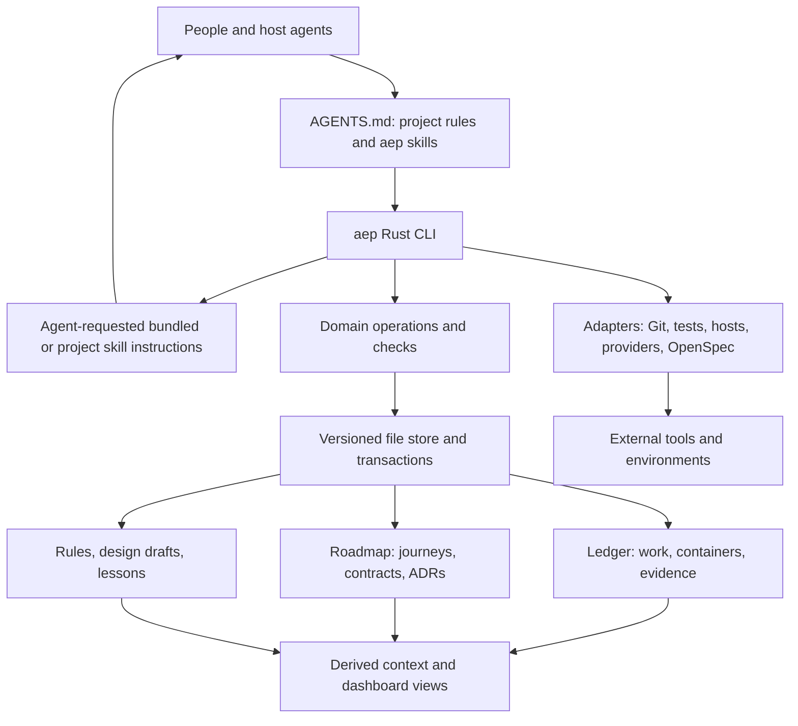

# AEP 5.0: Rust CLI, project context, and verification

AEP 5.0 installs as a Rust `aep` binary and a short AGENTS.md entrypoint. The working agent interprets the request, selects skills, and decides the work sequence. The binary serves the requested instructions, maintains project records, and runs explicit operations and checks. OpenSpec remains an integrated specification format and optional interoperability tool.

**Status:** Proposed architecture. **Target:** AEP 5.0.0, selected by the user. **Date:** 2026-09-09. No CLI or migration is implemented by this document, and the current release remains v4.1.0.

This is the entrypoint for the 5.0 design. It governs the implementation boundary and delivery order of the supporting proposals:

- [Context stores and migration](project-ledger-roadmap-and-memory.md): project-ledger, project-roadmap, change/BDD, decisions, and memory, grounded in downstream evidence and OpenSpec source.
- [Project rules and workflow](project-rules-and-story-workflow-refactor.md): short AGENTS.md, rule routing, isolated stories, verification, and learning.
- [Astra 6 review](astra6-v4.1-design-guidance.md): model guidance, observed contract gaps, and controlled evaluation requirements.

Earlier statements that AEP ships no runtime or that a release number is undecided describe v4.1 or the earlier proposal. The 5.0 target deliberately changes that boundary. OpenSpec integration remains part of the product; independence from its CLI is not removal of its specification concepts.

## 1. Product contract

A developer or agent should be able to answer and maintain these questions through `aep`:

1. What is the project for, what behavior is accepted, and why were its tradeoffs chosen?
2. What work is pending, what is ready, and which dependencies or gates prevent progress?
3. Which worktree/attempt owns this story, and what implementation/evidence did it produce?
4. Which behavior is only proposed, implemented locally, integrated, or released?
5. What did previous work teach us, and which rule or skill changes were actually adopted?
6. Can an old project adopt the current workflow, retain applicable rules and operational limits, and find older context in Git?

Normal lifecycle commands work without Node, OpenSpec, an LLM API key, or a memory service. Git is the required external tool for repository/worktree operations. Project tests still require their project toolchain. Optional provider/host/OpenSpec integrations declare their additional requirements; `aep doctor` reports capabilities per operation.

The command does not invent product judgment. A deterministic `aep change new` creates/validates a record; an agent using the design skill researches and authors its content. A BDD parser cannot decide that a scenario captures the right user outcome. A local Rust binary cannot prove the identity or authority of a person merely because a JSON field names them.

## 2. Architecture and ownership



| Component | Owns | Boundary |
| --- | --- | --- |
| Working agent | Intent interpretation, skill selection, task sequence, design and review judgment | Uses project evidence and the user's request within host authority |
| Rust domain core | IDs, references, readiness, transitions, proof requirements, risk derivation, diagnostics | No model/network/tool side effects |
| File store | Parsing, source preservation, revisions, transaction plans, recovery, derived indexes | No automatic approval or semantic rewriting |
| `aep` CLI | Public command/JSON contract and explicit operation execution | No mandatory hosted service |
| Bundled skill instructions | Product exploration, design, implementation reasoning, review, reflection | Served by `aep skills`; call CLI for state transitions instead of retyping YAML protocols |
| Host/harness | Agent lifecycle, permissions, communication, model settings | AEP binds attempts to verified worktrees and captures results |
| Project | Code, runnable checks, local rules, authority and delivery policy | AEP preserves existing project policy during adoption |
| Optional adapters | External tool/provider/OpenSpec interoperability | Capability-checked; cannot redefine canonical state |

Start with a Cargo workspace containing `crates/aep-core`, `crates/aep-store`, and `crates/aep-cli`. Keep adapters as modules until independent dependency/testing needs justify another crate. Existing `apps/`, TypeScript packages, and the skill corpus remain in this repository. The inspected baseline has no Cargo workspace; this is new implementation work.

Use typed Rust domain structures, Serde for serialization, and clap for the command surface. Clap's derived subcommands and Serde JSON's typed/value interfaces fit these boundaries. Pin exact dependency versions and a supported stable toolchain during the implementation bootstrap. YAML parser selection must pass duplicate-key, unknown-field diagnostics, scalar/date, and representative legacy fixture tests before adoption. [clap documentation](https://docs.rs/clap/latest/clap/_derive/_tutorial/index.html), [serde_json documentation](https://docs.rs/serde_json/latest/serde_json/).

## 3. Storage and versioning

Use the [proposed context stores](project-ledger-roadmap-and-memory.md#4-proposed-file-structure). Add a small tracked `.aep/config.toml` for format version, store locations, compatibility mode, project check definitions, and adapter configuration. `project-rules/aep.md` explains the project's workflow and points to executable configuration; it does not duplicate every setting.

Use one release pin for the CLI and its bundled instructions. Track record schema version and OpenSpec compatibility profile separately because they describe data compatibility. Record these versions and the bundled instruction digest in `aep doctor --json` and attempt receipts. A project's `.aep/config.toml` records its selected CLI release; an incompatible binary reports the mismatch before workflow mutations. An older binary refuses writes to an unsupported schema; it may provide a clearly limited inspection mode. A newer binary never silently migrates on a read command.

Canonical durable records remain reviewable Markdown/YAML/TOML in Git. Generated indexes, context packets, search caches, host handles, locks, and transaction staging are derived or runtime state. They must have an explicit home and ignore policy. No embedded database is required for 5.0; an optional later index remains rebuildable from canonical files.

Operational fields change through CLI transactions. People and agents can still author prose in an editor. `aep check` validates those edits before integration. Manual editing does not confer a protected status transition merely because a field says `passed`; gate evaluation requires the corresponding evidence and project authority rules.

Use one detailed change/BDD contract, referenced by story records. Preserve accepted contracts and historical deltas separately. New story records do not duplicate complete acceptance prose. Retain grouped story-to-change and multi-attempt relationships. Source aliases are explicit and provenance-bearing.

## 4. Command surface

All syntax below is proposed, not a claim that a binary exists. Keep command names task-oriented and make help/examples part of compatibility tests.

| Family | Principal commands | Result |
| --- | --- | --- |
| Guidance | `aep skills`, `aep skills show <name>` | Small skill catalog and the instructions/references explicitly requested by the agent |
| Project | `aep init`, `aep doctor`, `aep status` | Adopt/create minimal structure; report versions, capabilities, and project state |
| Context | `aep context <story-or-change>`, `aep query`, `aep timeline` | Cited, revision-aware context and filtered views |
| Roadmap | `aep roadmap show/update`, `aep decision new/accept/supersede` | Maintain intent, journeys, and decision provenance |
| Ledger | `aep story new/update/show`, `aep layer`, `aep wave`, `aep release` | Maintain work and container relationships without mandatory journey mapping |
| Change/spec | `aep change new/status/accept/close`, `aep spec diff/check/publish` | Manage change readiness, accepted intent, BDD deltas, and publication evidence |
| Execution | `aep dispatch plan/start`, `aep worktree inspect`, `aep attempt status/record/recover` | Claim ready work, bind isolation, track and reconcile attempts |
| Validation | `aep check`, `aep verify plan/run`, `aep review request/record`, `aep gate evaluate` | Static checks, actual check execution, review evidence, and gate verdicts |
| Delivery | `aep deliver plan/pr/merge/status` | Prepare or perform authorized integration/provider operations with receipts |
| Learning/rules | `aep lesson record/find`, `aep reflect propose`, `aep rule check/adopt/retire` | Capture evidence, prepare amendments, validate/adopt under project policy |
| Maintenance | `aep migrate plan/apply/verify`, `aep recover`, `aep openspec import/export/check` | Convert current context, recover interrupted writes, and exchange OpenSpec bundles; Git handles migration reverts |

Object updates accept structured input (`--file` or `--stdin`) and expected revision, avoiding long shell-escaped descriptions. Listing/show/query/doctor/check are read-only. Commands that produce mutations first compute a change plan internally and apply it within existing task authority; they do not introduce a human confirmation at every routine step. `--dry-run` exposes the same plan without mutation. An explicitly saved plan carries input hashes and expires on relevant drift.

Native subagents are not assumed callable from an OS process. If the active harness exposes delegation only to its parent agent, `aep dispatch start` creates the claim/worktree/bootstrap packet and returns a launch request for the skill to fulfill. A process-capable adapter may launch directly. Record which path was used; a prepared launch request is not a running worker. Both use the same attempt ID and readiness checks.

PR-only and merge-authorized requests have different terminal actions. `aep deliver plan` records the intended operation and required evidence. Execution checks relevant state again; a cached plan is not permission to exceed the current request. Provider timeouts trigger status reconciliation before retry so PRs/merges are not duplicated.

### Installation and progressive disclosure

Herdr provides the distribution precedent: its documented `herdr --skill` prints the instruction file bundled with the installed binary. Local inspection of Herdr 0.8.2 help confirms that option. AEP adopts that release coupling and adds a skill catalog and selective references for the agent to read. [Herdr agent skill documentation](https://herdr.dev/docs/agent-skill/).

The default AEP install consists of the native binary and a short project AGENTS.md route to `aep skills`. A host that reads a different entrypoint gets only a pointer to AGENTS.md. No per-runtime AEP skill copies, `npx skills` step, separate skill lockfile, or plugin registration is required. Project rules, configuration, ledger, roadmap, and lessons remain project-authored data: `aep init` and later work create only the files needed. They are not another installed instruction bundle.

Keep skill Markdown, templates, and references reviewable under AEP's source `skills/` tree. The release build embeds the selected content and a small catalog in the binary. Each catalog entry states its name, purpose, when to use it, and the command to read it. Applicability descriptions are instructions for the agent to interpret. Instructions ship with the command behavior they describe; normal reads need no network or model. Existing shared-source checks remain authoring tools, while release checks validate the embedded output. Optional host wrappers can call `aep skills show`; new installs do not need them.

| Disclosure level | Proposed command | Response |
| --- | --- | --- |
| Orientation | `aep skills` | Brief usage and skill names, purposes, applicability descriptions, and read commands |
| Selected procedure | `aep skills show design` | Only the design instructions, inputs, completion evidence, and named references |
| Needed detail | `aep skills show design --ref bdd` | One bundled reference, addressed through the CLI instead of an installed filesystem path |

Skill selection belongs to the working agent. It reads the catalog, considers the user's request and project context, and requests the relevant procedure and references. No CLI task-category enum or state-to-skill table decides which skill to use or which workflow step comes next. The catalog/show commands do not create work or require a story for analysis. AGENTS.md teaches this discovery process without copying the full catalog or procedures.

`aep status` reports recorded state and dependencies; `aep context <story-or-change>` retrieves explicitly linked records and requested sources; `aep check` validates declared constraints. These commands expose source revisions, missing references, unmet prerequisites, and unknowns. The agent decides which additional context to inspect and what work to do. Deterministic checks and scheduling of explicitly requested work remain in the CLI. They use declared dependencies, capacity, and configured policy; a missing design file does not decide that the user needs a new design, and passing checks do not decide that the user wants a merge. Operations revalidate their prerequisites when they execute.

All guidance commands are read-only and support Markdown and `--json`. Give each response a release/digest, skill/reference identity, and completeness indicator. Keep responses scoped; list further references or pagination explicitly instead of silently truncating required instructions. Orientation and bundled skill reads work outside an initialized project. If project status reports missing setup, the agent can read onboarding guidance from the catalog when the task calls for it. A missing binary must be reported without inventing commands; independent repository analysis can continue.

Project-owned procedures, such as `monet-*`, remain editable repository files. An optional `project-rules/skills/<name>/SKILL.md` location is indexed from `project-rules/README.md`; existing local skill paths can instead be registered in project configuration. `aep skills` exposes these through the same catalog/show interface with project provenance and revision. Duplicate names produce a diagnostic, and a local skill cannot silently replace a built-in procedure or check policy. Built-in changes require an AEP release; validated local learning can update project rules or procedures through normal project commits.

**Acceptance:** start from a project with an AGENTS.md entrypoint and the binary, with no installed AEP skill directories or external OpenSpec CLI. Deterministic fixtures verify catalog metadata, exact skill/reference lookup, offline reads, unknown names, version mismatches, and accurate status/check results after a changed gate. Agent trials separately evaluate skill selection, project-rule discovery, and task sequencing: answer an analysis request without creating work, carry an implementation request through its required checks, and retrieve a project procedure. Include requests with identical repository state but different intent, such as inspect versus implement or review versus merge. Compare missed instructions and context load with v4.1; a CLI fixture cannot prove semantic routing quality.

### Machine contract

Every command supports `--json` with one versioned JSON result on stdout; progress goes to stderr. Long-running verification may use an explicit event-stream mode with a documented terminal event. JSON includes operation identity, source revisions, data, diagnostics, and whether side effects occurred. Diagnostics carry a stable code, severity, affected record/path, evidence, and a mechanical remediation when known. The agent decides the broader next task.

Proposed exit classes: `0` successful requested operation; `1` validation/test failure; `2` invalid usage/input; `3` blocked by unmet prerequisites or required authority; `4` unsupported capability/version; `5` conflict or recovery required; `6` external execution/I/O error. A successful status query can report blocked records; a requested failing check returns nonzero. The JSON verdict and operation status remain separate, and no command prints success before its required effects are confirmed.

## 5. Our check system

The CLI's check registry owns deterministic validation. A check descriptor names its ID/version, inputs and applicability, result schema, evidence requirements, and whether it is pure validation or explicit execution. Project check configuration is reviewed executable policy. Imported prose or recalled lessons cannot install a runnable hook automatically.

| Check class | Examples | What it cannot establish alone |
| --- | --- | --- |
| Format | Parsing, duplicate keys, schema versions, required fields | Correct user intent |
| References/graph | IDs/aliases, missing references, cycles, membership, grouped changes | An implied dependency that was never specified |
| Design/BDD | Required design fields, scenario IDs, delta conflicts, baseline revision | That the examples cover the user's real goal |
| Rules/scope | Applicable rule links, declared/actual diff, sensitive paths | Unlimited authority from a rule file |
| Worktree/attempt | Base/head/cwd, ownership, duplicate attempt, stale update | OS isolation unavailable in the host |
| Verification evidence | Test/probe identity, input digest, exit/result, head/environment, stale evidence | That a test suite detects every defect |
| Review | Required independent review present, findings and closure evidence | That a model grader is always correct |
| Gate/promotion | Correct scope, prerequisites, current evidence, required decision | Deployed behavior from a merge receipt |
| Migration/history | Git source references, current dependency/gate graph, no invented dates/statuses, no-op rerun | Complete reconstruction of historical context or proof that never existed |
| Learning | Provenance, applicability, duplicate/conflicting candidates, validation record | General transfer from one successful example |

`aep check` does not silently execute the repository's tests or call a model. `aep verify plan` selects relevant configured checks from the actual diff and policy. `aep verify run` executes them under the existing host permissions, records evidence, and returns results. Launch subprocesses with structured argv, explicit cwd, bounded output, timeouts, cancellation, and declared environment needs; do not interpolate arbitrary Markdown into a shell command. Project scripts remain external code whose trust is governed by the project/host.

Use a common result vocabulary for performed checks: `pass`, `fail`, `blocked`, and `skipped`, with a reason and applicability. Unknown or stale evidence is a property of the evidence record, not a passing check. Required blocked/skipped evidence cannot satisfy a gate. A non-required optional check can be skipped without blocking. A human exception, where policy permits one, retains the failed/absent check and records the exception; it does not rewrite the check to pass.

A receipt records check ID/version, command or review method, actor/host provenance, start/end time, tested revision and relevant input digests, environment scope, result, and artifact links/digests. Imported self-reports retain their evidence class. A checksum detects change, not truthful authorship; higher-assurance provider/CI receipts are used where project policy requires them.

Cache only results with explicit input/environment fingerprints. Reuse requires matching relevant inputs, policy/check version, and freshness requirements. A post-review code edit, changed gate scope, or mutable external environment can invalidate evidence. Enforce the final check against the integration candidate; checks of an earlier head do not silently certify a later merge.

Keep current verification floors and bounded gen-eval while porting them into one policy implementation. One self-validation pass plus risk-based independent review remains the target. Stage any relaxation after the context/CLI migration so a new engine and weaker verification cannot hide each other's defects.

## 6. OpenSpec integration without a core runtime dependency

Adopt an explicitly versioned AEP OpenSpec compatibility profile. The first reference profile is OpenSpec v1.12.0, audited at `e062b9572be933564ba3899d059377dfa1393e32`. Support its common requirement/scenario and ADDED/MODIFIED/REMOVED/RENAMED delta structures. Preserve original Markdown and unrecognized extensions on import; unsupported semantics produce diagnostics rather than guessed conversions.

OpenSpec custom schemas and `planningHome` do not expose arbitrary routing across the proposed stores at that version. Links to external ADRs can coexist with OpenSpec, but do not make them CLI-managed artifacts. [Planning-home implementation](https://github.com/Fission-AI/OpenSpec/blob/e062b9572be933564ba3899d059377dfa1393e32/src/core/planning-home.ts), [root resolution](https://github.com/Fission-AI/OpenSpec/blob/e062b9572be933564ba3899d059377dfa1393e32/src/core/root-selection.ts).

Three integration levels keep ownership clear:

1. **Built-in format support:** Rust parses/checks the supported specification subset and maintains AEP change/spec evidence. This is the normal path and needs no OpenSpec installation.
2. **Explicit import/export:** `aep openspec import` creates a provenance-bearing candidate transaction; export writes a compatibility bundle for another tool. The manifest marks the source revision and writable owner. Round trips preserve supported semantics; unknown/custom artifacts remain opaque or require a mapped adapter.
3. **Optional reference-tool check:** an explicitly enabled adapter invokes a pinned OpenSpec CLI against a disposable exported bundle for compatibility comparison. It does not run archive/sync against the canonical project stores or substitute OpenSpec's completion labels for AEP gates.

AEP owns semantic publication/conflict checks for its stores. Preserve requirement/scenario IDs and baseline hashes; reject conflicting concurrent deltas. Semantic reconciliation can be proposed by a person or model, then validated and reviewed. Do not claim that reproducing OpenSpec's generated sync prompt yields a deterministic equivalent of its archive implementation.

For old projects that still need OpenSpec writers, keep legacy mode authoritative until those writers can cut over. Once AEP is authoritative, exported OpenSpec files are derived compatibility artifacts. No automatic bidirectional sync and no symlink trick that lets both tools modify different views of the same records.

## 7. Transactions, concurrency, and recovery

A file-based store needs more than atomic JSON writes. Use one transaction API for every state mutation:

1. Resolve the actual repository/worktree and canonical store; validate allowed paths and expected revisions.
2. Acquire the store's cooperative lock and re-read relevant inputs. Worktrees sharing an integration store use a lock identity derived from the Git common directory and store identity. Separate clones do not share that lock.
3. Build and validate the complete candidate set, including graph/gate invariants. Persist a transaction manifest with old/new hashes and staged bytes before replacement.
4. Replace target files from same-filesystem staging, preserving required modes; persist progress for recovery. Publish the transaction-complete marker only after the full set succeeds.
5. Release the lock and return a receipt. Readers obey the same protocol: they reject/recover an unfinished transaction or retry a changed revision instead of consuming a partial record set.

Rust exposes file locking and sync operations; rename has filesystem/platform constraints. A sequence of renames is not an atomic multi-file transaction. Crash recovery, durability boundaries, and platform behavior therefore need fixtures. File locks are cooperative and do not protect against every manual editor or a second clone. Use content-hash conflicts and Git/CI validation at integration as well. [Rust File](https://doc.rust-lang.org/std/fs/struct.File.html), [Rust rename](https://doc.rust-lang.org/std/fs/fn.rename.html).

A small recovery journal protects in-progress CLI writes. It is temporary runtime metadata; Git retains committed history and handles migration recovery. `aep recover` can finish or restore a prepared transaction only when current hashes match the expected intermediate state. Unexpected edits require a conflict report; never overwrite later user work. Read-only commands report recovery requirements without silently changing files.

External effects use a different protocol: persist intent/operation ID, perform the effect, query/record its outcome, and reconcile ambiguous results. Local rollback cannot undo a published PR, remote merge, or deployment automatically. Store the external identity and recovery action. Preserve this distinction in cancellation and migration.

## 8. Design, implementation, and learning workflow

```text
frame product intent / identify maintenance need
  -> author one change + BDD contract + needed ADR
  -> aep check / verify readiness
  -> aep dispatch: dependency and capacity-aware worktree attempts
  -> implement + self-validate
  -> independent review where required
  -> integrate + publish contract evidence + evaluate delivery gate
  -> record lesson -> propose rule/skill change -> validate -> adopt -> observe
```

Map existing skill responsibilities into bundled procedures and commands. Old names describe the source mapping below; installing their slash-command files is optional compatibility work:

- `aep-onboard` / scaffold inspect the project and call CLI adoption/migration/check operations; keep project configuration and short instruction routing intact.
- Envision/map/model/design guide product decisions and author content, using CLI checks and typed records. A maintenance item can bypass product remapping while still supplying a sufficient change contract.
- Dispatch/launch/executor become orchestration guidance and host adapters around the CLI's single readiness/claim/worktree contract. Existing integrations can use thin compatibility wrappers where needed.
- Build runs in its assigned worktree, executes verification, and returns evidence. Wrap/integration publishes results through CLI transactions and existing authority.
- Reflect proposes a concrete rule/local-skill/upstream change from cited lessons. A learned preference never becomes a permission grant. Adoption uses the project policy and held-out/counterexample validation; rejected and retired proposals remain searchable history.

The CLI manages records and checks for skill amendments; it does not edit its own executable or deploy a candidate rule merely because a model recommends it. Project-specific learning goes to project-rules or local skills. Reusable AEP behavior changes go through AEP source, release, and downstream re-pin.

## 9. v4.1 to v5.0 migration and release

Git is the historical and recovery source for old projects. `aep migrate plan` records the base commit, relevant source paths, current context to carry forward, required consumer changes, and active work. Keep unrelated dirty/untracked work outside the migration diff. Convert active work and the completed records it depends on, current contracts, useful roadmap/ADRs/lessons, and applicable rules. Older records can stay in Git and be retrieved by commit/path when needed. The [migration design](project-ledger-roadmap-and-memory.md#8-migration-plan) defines this bounded conversion.

Adapters support legacy single YAML, split product context, and selected OpenSpec bundles. Preserve IDs/aliases, dependencies, active gate scope, and applicable custom checks for migrated work. Unknown current constraints need resolution; historical fields do not require exhaustive translation, copied snapshots, or a reverse converter. Preserve unknown chronology and do not infer implemented/released from archived/completed metadata. `apply` reuses ordinary transaction handling; `verify` checks the new structure, current links/readiness, consumer routing, and no-op rerun. Save a small receipt with the Git source and unresolved current mappings. Recovery uses a normal Git revert or selective restore in a reviewed branch.

Ship the CLI with embedded skills, templates, schemas, checks, and compatibility profile as one 5.0 release. Publish native binaries for tested Linux/macOS architectures and checksums; state Windows support only after its filesystem/process tests pass. Rust is required to build from source, not to use a supported prebuilt binary. `aep init` wires the AGENTS.md entrypoint and project configuration; default adoption adds no runtime-specific skill bundle or Node/OpenSpec bootstrap step.

Before release, confirm the public binary/package name and distribution channel are available; do not assume that the `aep` registry name can be published. Document supported OS/architecture and minimum Git/toolchain versions from actual CI. Keep the chosen binary release reproducible and inspectable through doctor and guidance output. An upgrade changes one release pin and checks schema compatibility; it does not reinstall skills once per host.

A 4.x consumer can remain pinned while another migrates. Active old-contract stories finish or restart explicitly; changing the main branch's CLI/instruction release does not retroactively change their records. After switching affected entrypoints and consumers, remove unused vendored AEP skill copies and their AEP-only lock entries; preserve unrelated local skills and shared lock entries. Keep legacy views only where needed and disable old writers before cutover. The dashboard must use the new Rust-owned JSON/read model or a tested adapter; do not maintain a competing TypeScript readiness algorithm.

## 10. Implementation stages and release gates

| Stage | Scope | Exit evidence |
| --- | --- | --- |
| 0 | Finalize minimal bootstrap, skill catalog, schemas, operations, and compatibility profile | Reviewed agent/CLI responsibility boundaries and task/context examples |
| 1 | Rust core/store/CLI: embedded skills, doctor, inspect, query, static check | AGENTS-to-CLI discovery without installed skills; offline selective reads; parsing/reference/graph fixtures; stable JSON/errors |
| 2 | Transactions, init, and practical migration plan/apply/verify | Current-context conversion and Git references; crash/stale-write handling; no-op rerun |
| 3 | Change/BDD/spec/rules/lesson maintenance and OpenSpec integration | Supported-subset round trips, unsupported custom diagnostics, promotion evidence and concurrent-delta fixtures |
| 4 | Worktree dispatch, verification runner, reviews, gates, delivery receipts | Dependency/capacity/isolation checks, timeout/cancel recovery, stale evidence, provider reconciliation |
| 5 | Guidance and dashboard cutover; representative downstream pilot | Usable current context and full lifecycle, preserved custom preflights, next-task recall without separate AEP skill installs |
| 6 | Release 5.0.0 | Native install matrix, embedded instruction/command consistency, changelog/tag/migration notes, documented support and limitations |

Use Rust unit tests for pure invariants and integration fixtures for filesystem/process behavior. Extend the repository's existing shell fixture corpus to exercise the binary and preserve current routing/verification cases; do not port only success paths. Keep checks independent from the behavior they certify. Required cases include malformed data, incomplete tasks, empty lessons, duplicate layer gates, partial/unsynced specs, unsafe path resolution, lost worker handles, changed merge candidates, and interrupted external operations.

For the initial pilot retain verification floors and compare v4.1 outcomes against 5.0's normalized state and context answers. Then measure time to dispatch/integration, repeated checks, missed rules, citation/temporal accuracy, escaped defects, and context load on fixed tasks/model settings. An engine rewrite does not itself establish Astra efficiency or memory quality. Treat any verification or learning-policy relaxation as a separate controlled experiment.

The first implementation slice should prove AGENTS.md → skill catalog → agent selection → requested guidance and context inspection. Then establish native record maintenance and a practical conversion of current project context. Git provides access to old files; full historical reconstruction is not a release gate. No downstream is declared upgraded until its current workflow and required checks work under the new contract.
