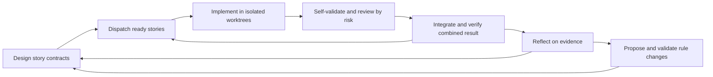

# Project rules and a simpler story workflow

**AEP 5.0 entrypoint:** [Rust CLI, project context, and verification](aep-v5-rust-cli-architecture.md) defines the release target, native command/check system, and OpenSpec integration. It takes precedence where this supporting review describes an earlier implementation boundary.

AEP should make design, isolated implementation, verification, and learning reliable while the host manages agents.

**Status:** Proposed architecture; no runtime changes. **Date:** 2026-09-08. **Source baseline:** AEP v4.1.0, `acf03fc41fe25faf67905c9004451702b7986dd8`.

This proposal extends the [Astra 6 review](astra6-v4.1-design-guidance.md) with four design decisions: a short generic AGENTS.md, project-owned rules, less orchestration in skills, and a complete path from lessons to tested rule changes. It replaces the earlier review's incremental-only delivery order for these areas. Its evidence and authorization fixes still apply. PR #33 remains secondary background.

**Context-store follow-up:** [Project ledger, roadmap, specifications, and memory](project-ledger-roadmap-and-memory.md) defines the proposed replacement for product context, optional OpenSpec integration, and the singular lesson store. Its source ownership and migration order take precedence over the existing-store references below.

## Recommendation and evidence

Adopt `project-rules/` as the project maintenance rule surface. Keep AEP's model-independent core as a story contract, dependency readiness, an isolated worktree, checkable completion evidence, and a learning record. Use the host's agent lifecycle through a small adapter. Keep independent review where risk warrants it, with self-validation on every implementation.

The following sources were retrieved on the review date. Official product documentation describes capabilities and guidance; it does not establish the outcome of an AEP experiment.

| Source | What it establishes | AEP implication |
| --- | --- | --- |
| [Astra guidance](https://developers.openai.com/api/docs/guides/latest-model?model=gpt-6-astra) | Instruction conflicts, delegation, and verification need deliberate prompting. | Remove contradictory skill procedures before adding more agent instructions. |
| [Codex subagents](https://learn.chatgpt.com/docs/agent-configuration/subagents) | Native delegation supports independent work; model/effort and permission inheritance have defined behavior. | Reuse host lifecycle and settings instead of duplicating them in every skill. |
| [AGENTS.md discovery](https://learn.chatgpt.com/docs/agent-configuration/agents-md) | Instructions are discovered along the root-to-working-directory path, with nearer guidance taking precedence. Arbitrary filenames are not automatically discovered. | A rule index needs an explicit entrypoint and task-based selection. |
| [Evaluation best practices](https://developers.openai.com/api/docs/guides/evaluation-best-practices) | LLM graders require clear criteria and calibration against human labels; they have position and verbosity biases. | A model saying its work is correct is insufficient evidence for eliminating review. |

No retrieved source proves that Astra self-review replaces independent review across coding, data migrations, security, and deployment. Nor does native subagent support prove separate worktrees, durable workers, or identical recovery on all hosts. The designs below account for those limits. They are proposals to measure, not measured improvements.

## 1. Project structure: short entrypoint, scoped rules

### Ownership

| Surface | Owns | Does not own |
| --- | --- | --- |
| Root `AGENTS.md` | Generic task agreement, project-rule discovery, and the `aep skills` entrypoint | Complete command catalogs, deployment policy, copied skill procedures |
| `project-rules/README.md` | Rule index, applicability, project maintenance categories | A second copy of each rule |
| `project-rules/*.md` | Project-wide code, test, architecture, DevOps, release, and workflow rules | Runtime status or historical lesson logs |
| `project-rules/packages/*.md` | Rules scoped to an existing app/package or shared module | New directory requirements for every project |
| Project-owned skills | Repeatable procedures exposed through `aep skills`, with a trigger, inputs, steps, and checks | Built-in AEP source patches |
| Existing configs and scripts | Executable settings and checks | Duplicated prose values that drift |
| `lesson-learned/` | Observations and evidence for proposed changes | Rules automatically made binding by their presence |

Example layout for a monorepo; scaffold creates only applicable files:

```text
AGENTS.md
CLAUDE.md                       # imports AGENTS.md where needed
project-rules/
  README.md                     # scope/task -> applicable documents
  architecture.md
  code.md
  testing.md
  devops.md
  release.md
  aep.md                        # workflow; links to CLI pin/configuration
  skills/                       # optional project-owned procedures, e.g. monet-*
  packages/
    web.md
    server.md
apps/                           # retain this project's existing code layout
packages/
lesson-learned/
```

A single-package repository uses the same index without the monorepo directories. This migration does not rename application directories or relocate unrelated documentation.

### Candidate AGENTS.md

The following is a candidate template, not an installed file. Substitute the actual release marker when shipping. Aim for about 20–30 substantive lines; semantic preservation is the acceptance condition, not a hard line quota.

```markdown
<!-- aep-agents-template: vNEXT -->
# AGENTS.md

Read README.md for project context, then project-rules/README.md if present.
That index identifies project-specific maintenance rules, including code,
testing, package boundaries, DevOps, release, and AEP configuration.
Load the rules for the task and all affected paths before making changes.
Check scoped instruction files for affected directories; follow the host's
instruction precedence. Recheck applicable rules if the scope changes.

Run `aep skills` for skill names, purposes, and when to use them. Select
skills based on the user's request and project context, then read them with
`aep skills show <name>`. Load named references only as needed. Use `aep status`,
`aep context`, and `aep check` for facts and declared constraints. Decide the
work sequence yourself and reassess it after material scope or state changes.

Use the user's request and prior authorization to define the deliverable.
Complete authorized work and verify it. Analysis requests produce findings.
Ask when a missing decision changes the result or an action needs authority;
continue independent work while that decision is pending.

Use repository evidence and preserve unrelated user work. Make a coherent,
scoped change. Run required checks; report actual results and remaining gaps.
User instructions take precedence over skill guidelines within host controls.
When guidance causes a stop, cite its command or file and operative instruction.
End with the outcome, relevant evidence, and unfinished work.
```

This keeps project-specific classification and CLI discovery visible at the entrypoint. The agent selects skills and work order; the CLI serves requested content and reports state and checks. Detailed command lists, test commands, release sequence, style register, and package-specific exceptions belong in indexed rules or selected CLI guidance. The template marker remains for migrations; `.aep/config.toml` records the selected binary release, and `project-rules/aep.md` explains project workflow settings. Built-in skill instructions ship inside that binary, so normal installation needs no per-runtime AEP skill copies or separate skill lockfile. See the [progressive disclosure contract](aep-v5-rust-cli-architecture.md#installation-and-progressive-disclosure).

### Rule selection and precedence

The index is a short table with columns **task/path**, **rule file**, and **purpose**. Include cross-cutting categories: a database migration can require both package rules and data/DevOps rules even if its path appears to be ordinary source code. List new-file destinations as well as existing paths. For a changed scope, reload the additional applicable rules before continuing.

Each rule states its scope, required behavior, reason, and verification source. Link to actual configuration and scripts instead of copying command flags or inventing missing tooling. Add an owner or review trigger when useful; do not require a large metadata schema for a five-line rule.

The index does not override the host's system/developer/organization controls. A package exception to a project default must be explicit. Conflicting rules for the same scope require resolution; loading order alone should not silently decide a business or deployment policy. Preserve existing nested AGENTS files during migration. Where a host needs a nested entrypoint, use a short pointer to the canonical package rule. A root-started session should inspect affected directories explicitly rather than assume deeper instructions were preloaded.

**Acceptance:** a web-only edit loads web and relevant shared rules; a CI edit loads DevOps rules; an API-plus-web edit loads both package rules and interface rules. A cross-cutting data migration cannot escape its checks through a path-only match. Missing indexed files produce an explicit diagnostic, not an invented rule. No project setting exists only in a removed AGENTS section.

## 2. Scaffold and old-project migration

Separate the operations under existing entrypoints:

- **Onboard:** establish the CLI release, AGENTS-to-CLI discovery, and required host/tool capability.
- **Scaffold:** build a missing project capability, or audit/converge an existing one within the request's scope. For an existing project, preserve its stack, code layout, and working commands.
- **Migration:** a scoped conversion of current rules and context, with a preview, usability checks, and Git history for recovery.

The current [onboard contract](../../skills/project-setup/onboard/SKILL.md), [migration ledger](../../skills/project-setup/onboard/references/migrations.md), [scaffold audit](../../skills/project-setup/scaffold/scripts/audit.sh), and [structure reference](../../skills/project-setup/scaffold/references/resulting-structure.md) explicitly depend on `project-convention/` and the `AEP Workflow` heading. All need to change together with their fixtures. Merely renaming the directory would make the current audit report drift.

### Migration cases

| Starting state | Migration action |
| --- | --- |
| New project | Generate the short entrypoint and minimal applicable rule index. |
| Only `project-convention/` | Preserve and move its rule content into `project-rules/`; repair relative links and live references. |
| Only `project-rules/` | Adopt and audit the existing index; preserve custom rules and structure. |
| Both directories | Identify current rules, duplicates, and conflicts; map the active rules without overwriting by directory precedence. |
| Large hand-written AGENTS/CLAUDE | Route applicable rules and procedures to the new structure; leave historical material accessible through its Git source. |
| Nested instructions, override files, or symlinks | Inspect their actual discovery and targets; preserve them until a tested mapping exists. |
| Active v4.1 story/worktree | Finish on its recorded pin and rules, or explicitly restart on the new contract; do not change rules underneath the run. |

### Procedure

1. Record the Git base, affected paths, instruction discovery, current rules, consumers, and active work. Use a migration branch and preserve unrelated edits.
2. Map applicable rules and procedures to their destinations and record unresolved current conflicts. Cite the old commit/path for historical sections; complete per-section archival conversion is unnecessary. Do not carry forward broad destructive heading-replacement procedures.
3. Move rules, repair active links, and wire the small AGENTS.md entrypoint to `aep skills`. Update affected scripts and rendered recipes against project customizations. Keep a legacy reader or old-path pointer only where it serves a current consumer.
4. Select one CLI release with embedded instructions and commit its project pin. Remove obsolete AEP skill copies and AEP-only lock entries after their consumers switch; retain unrelated local skills and host settings. A host needing another instruction filename gets a pointer to AGENTS.md.
5. Validate CLI discovery, required-rule applicability, links, affected scaffold/recipe checks, and a no-op second migration. Update the marker after success and report remaining current-work issues. Publish the migration PR with its Git base; recovery uses a reviewed Git revert or selected file restore that preserves later work.

**Required fixtures:** the minimal binary-plus-entrypoint install, legacy and already-adopted rule directories, conflicting current rules, host entrypoint pointers, a customized old recipe, and a second run with zero diff. Audit must verify that AGENTS routes to the active rule index and CLI guidance. Include unknown/non-English current sections to catch accidental rule removal. Extend fixtures when an actual project's input needs it; converting every historical layout is not a prerequisite for the native workflow.

## 3. Generation and evaluation: keep evidence, reduce ceremony

AEP's pattern is generation plus evaluation, not GAN training. Adversarial review is one review technique: actively seek a counterexample to an acceptance criterion. It need not be a mandatory debate between two agents for every edit.

The existing [verification economics](../../skills/patterns/gen-eval/references/verification-economics.md) already gives `light` zero evaluator rounds, while `standard` and `deep` allow at most two. `light` is narrowly derived for documentation changes without contract obligations; test/policy changes have a higher floor. This is a useful starting point.

### Proposed verification contract

| Work | Mandatory evidence | Independent review |
| --- | --- | --- |
| Eligible low-risk change | Builder checks actual behavior/diff against acceptance criteria and runs applicable deterministic checks | Omitted only when the binding recipe permits it |
| Ordinary behavior/interface change | Self-validation, contract checks, required CI/integration evidence | One fresh review; second round only for blocking-fix confirmation under the existing cap |
| Auth, payments, data migration, deployment, verification-policy change | Relevant hard-floor checks and failure/rollback evidence | Required by risk policy; specialist/human review where the project requires it |

Self-validation means inspecting results and exercising relevant failure cases. It is not a prose claim of confidence. The reviewer receives the acceptance contract, base/head identity, applicable rules, diff, and check artifacts. It should form its judgment without inheriting the builder's persuasive narrative. A different context of the same model is useful separation, but does not establish independent error distributions; another model family is also not a correctness guarantee.

Move risk derivation to one canonical validation policy/recipe used by design, build, and integration. Serve gen-eval guidance through the CLI; retain an `aep-gen-eval` wrapper only for consumers that need it. Avoid competing optional-evaluator flags in launch and build. Re-derive risk from the actual diff and recheck stale evidence before integration. The builder cannot lower its own verification floor or waive a failed check.

**Research decision:** simplify the pattern now without expanding the self-review-only class. To test that expansion later, compare unchanged v4.1, compact risk-based review with the same floors, and self-review-only on a defined eligible subset. Hold model, effort, tasks, and environment fixed. Use seeded defects, external tests, and blinded human-calibrated review to measure escapes, false positives, cost, and elapsed time. Production canaries retain current floors until the experiment supports a separate decision. Never include high-risk changes in an unapproved relaxed production policy.

## 4. Dispatch implementation when dependencies are ready

The current [executor](../../skills/patterns/executor/SKILL.md) is already native-first. [Dispatch](../../skills/product-context/dispatch/SKILL.md) already offers batches, file-conflict filtering, and WIP limits. Simplification should consolidate those contracts rather than add another orchestrator.

### Public workflow



A dependency becomes available from accepted integration evidence, not from an agent's completion message alone. Dispatch can refill a free slot as soon as a ready story has its prerequisites; it need not wait for unrelated stories in a wave. Existing release/layer gates still constrain readiness. Removing those gates would be a separate product-delivery decision.

### Responsibility changes

The old skill names below map existing responsibilities to bundled CLI guidance. They are not a requirement to install each slash command in 5.0.

| Skill | Proposed responsibility |
| --- | --- |
| `aep-design` | Resolve intent, define contracts and failure cases, establish dependency readiness and verification obligations. |
| `aep-dispatch` | One scheduling pass: reconcile, select eligible stories, claim capacity/ownership, hand off, and return state. An authorized batch fills available slots. |
| `aep-launch` | Internal worktree/bootstrap operation; optional compatibility wrapper for an existing caller. |
| `aep-executor` | Thin host adapter: capability probe, start, status/steer, stop/recover. Host-specific recipes live in references. |
| `aep-build` | Implement one story, self-validate, request review by recipe, and publish a checkable completion artifact. |
| `aep-wrap` | Serialize integration writes, check the combined result and existing layer gates, archive evidence, collect lessons. |
| `aep-autopilot` | Optional continuous driver that repeats scheduling/reconciliation; no duplicate policy or mandatory background loop. |
| `aep-reflect` | Route product feedback and turn process evidence into evaluated rule/skill proposals. |

Design outputs should have explicit readiness: objective/non-goals, acceptance/failure cases, interface inputs/outputs, dependencies, affected paths/ownership, applicable rules, verification, and migration/recovery when relevant. Put these in the canonical change/BDD contract and referenced design; OpenSpec supplies the compatible format. A tiny change can have a short design. An already sufficient design does not need another design round.

### Minimal execution contract

Use one implementation worktree and branch per dispatched story, created from an explicit commit containing the approved design and accepted dependencies. Host-managed worktrees are acceptable if their identity/base/ownership can be verified; do not nest a second worktree simply to match a preferred folder name. Native subagents that share a directory need explicit worktree binding and a successful cwd/base check before writes. If a host cannot enforce the required isolation, use a suitable process worker or a serial worker bound to the correct worktree.

Keep one durable story-attempt record using the existing state/signals, with story ID, attempt ID, worktree, branch/base SHA, design/rule revision, host handle, status, and result artifact. The coordinator alone updates the shared story graph and integrates. Workers own their worktree and signals. Reservations and attempt IDs must prevent duplicate dispatch during recovery; an agent handle alone is not durable proof of ownership.

Readiness is dependencies satisfied plus design complete plus no conflicting write ownership plus capacity plus required gate status. Prefer critical-path/unblocking work within project priority. Use the minimum of project WIP and actual host capacity, accounting for reviewers and other active workers; keep room for validation instead of filling every slot with builders. An in-review story still consumes resources until its worker/ownership is released.

For example, finish and integrate a shared API contract, then launch web and server stories concurrently from the accepted base if their write sets are independent. Integrate their results serially and run the combined contract checks. If an existing dependency truly needs another implementation first, wait. Speculative stacked branches are a later optimization with their own rebase and invalidation rules.

**Acceptance:** a dependency diamond dispatches each story once; unrelated ready work fills free slots; overlapping writes serialize; review can obtain capacity; restart reconciles a lost handle without repeating a PR/merge. Unrelated dirty files in the main checkout do not force a stash when an immutable committed base is available. Missing/uncommitted required design still blocks the handoff. Keep remote-base requirements for hosts that need remote materialization; use a verified local commit only where supported.

## 5. Complete the learning loop

Current [reflect](../../skills/product-context/reflect/SKILL.md) classifies process feedback and proposes skill amendments. [Convergence](../../skills/agentic-development-workflow/wrap/references/convergence.md) already archives evidence and creates layer distillations. The missing path is a controlled promotion from observation to active project rule or reusable procedure, followed by measurement and retirement.

Use this sequence:

```text
observation -> diagnosis -> smallest useful correction -> candidate diff
            -> validation -> authorized adoption -> observe -> keep/revise/retire
```

| Finding | Destination |
| --- | --- |
| One-time incident or uncertain cause | Lesson with evidence; no new rule yet |
| Wrong/missing executable setting | Fix the configuration or test before adding prose |
| Stable project-specific maintenance requirement | Scoped `project-rules/` entry |
| Repeated project procedure | Project-owned skill under its project prefix, such as `monet-` |
| Defect in reusable AEP behavior | AEP decision and upstream skill PR, then release/re-pin |
| Changed product assumption or desired behavior | Existing story/design/reflect product path |

A candidate records the observed failure, evidence/attempt, proposed scope, why an existing rule or check is insufficient, smallest diff, success check, and rollback/review trigger. Search for an existing overlapping rule before adding one. A single confirmed serious defect can justify a correction; repetition alone does not prove a general rule. Prefer editing or retiring stale rules over accumulating instructions.

Workers may record lessons and prepare candidate diffs within task authorization. Adoption follows existing project authority: normal reviewed PRs by default, or an explicit standing policy for automatic changes within a narrow scope. This is not a new confirmation question for every lesson. Changes to permissions, verification floors, merge/deployment authority, or global agent policy need the corresponding authorization and independent validation. The same run cannot rewrite its acceptance criteria to make itself pass.

Built-in AEP guidance changes in AEP source and ships with a CLI release. Put project-specific behavior in project rules or local procedures such as `monet-*`, exposed through `aep skills`; send reusable changes upstream. Existing vendored AEP copies are not the learning surface. Record the CLI/instruction release and design/rule revision used by each attempt. Apply an adopted rule to new attempts; explicitly restart affected work when a correction must apply immediately.

**Acceptance:** a repeated deploy configuration error becomes a scoped config fix or DevOps rule with a reproduction check, not a generic AGENTS warning. Duplicate lessons propose one amendment. A failed candidate is not activated. A rollout regression can revert the rule without deleting the evidence. Rule removal is evaluated as carefully as rule addition.

## 6. Delivery plan and success criteria

| Stage | Deliverable | Required evidence |
| --- | --- | --- |
| 1 | Short entrypoint, bundled skill catalog/show, `project-rules`, scoped migration | Install without runtime-specific AEP skills, required-rule discovery, current-context conversion, Git provenance, idempotency |
| 2 | Design readiness and consolidated dispatch/launch/executor contract | Existing routing parity; dependency, isolation, capacity, recovery, and integration fixtures |
| 3 | Compact self-validation/review contract with unchanged floors | Existing derive-recipe checks, seeded defects, stale-evidence checks, live Astra comparisons |
| 4 | Lesson promotion to project rules/local skills/upstream PRs | Provenance, duplicate/conflict checks, scoped adoption, rollback, and measured follow-up |
| 5 | Optional policy reductions and retirement of compatibility paths | Separate evidence-backed decision and consumer migration |

Use existing `scripts/test-scaffold-audit.sh`, `scripts/test-scaffold-converge.sh`, `scripts/test-detect-backend.sh`, recipe fixtures, and routing observations as the extension points. Do not create a second test framework. Skill descriptions/triggers that change need new observations of agent selection from the catalog; CLI fixtures validate content delivery and declared checks. Run package, generated-source, vocabulary, and steering checks when implementing skill changes.

Trial each stage separately so a directory move, scheduler change, and weaker review policy cannot hide one another's effects. Measure time from ready to started, time to accepted integration, dispatch overhead, merge conflicts, duplicate actions, missed rules, unnecessary pauses, escaped defects, and useful rule adoption. Capture per-case results and unknown costs. Use the first guide's controlled Astra trial design; establish explicit acceptance bounds before a policy experiment. Lower loaded instruction size and more spawned agents are not success metrics on their own.

Roll out first in a downstream fixture, then one representative existing monorepo, then additional old-project layouts. Name the pilot from current inventory when implementation starts. Keep active stories on their original contract. Retain aliases/readers where active consumers need them, with Git available for older records. The default 5.0 install uses CLI guidance instead of per-runtime skill bundles. Follow the [release convention](../../project-convention/release.md); the overarching Rust CLI design selects AEP 5.0.0 for the full contract change.

This design defines target responsibilities and staged implementation. Live comparisons and concrete downstream migration PRs remain implementation work; no downstream migration or measured Astra performance is claimed here.
