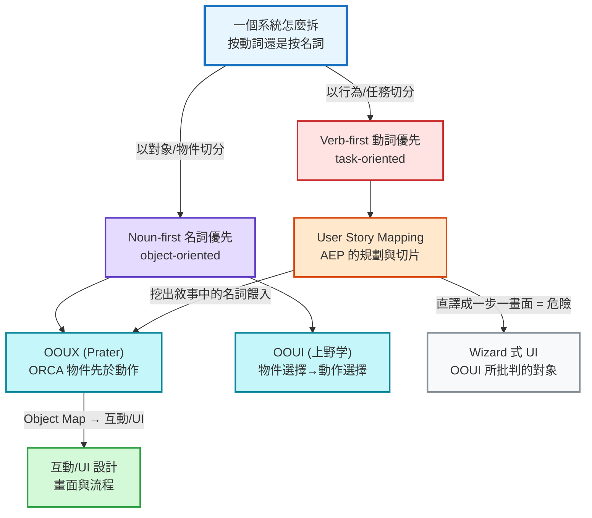

# OOUX / OOUI 物件導向設計 × AEP 工作流研究

> **狀態：** 研究筆記（非實作計畫）。記錄 OOUX/OOUI（名詞優先）與 AEP（USM 動詞優先）的對照，回答「能否在所有 UI-facing design 階段先產生可審閱的 UI 結構計劃」。AEP 整合設計見 §7，**列為後續 follow-up，不在本次提交範圍**。
> **日期：** 2026-06-16　**分支：** `docs/ooux-object-modeling-research`
> **方法：** 以使用者既有的對抗式查證筆記《Task vs Object 設計之爭》為理論骨幹，本次再以 `defuddle` + `WebFetch` 直接抓取一手網址補強（mgrep `--web` 本月配額用盡）。逐條標註「本次實抓」vs「沿用既有查證」。

---

## 0. TL;DR

- **「按動詞切還是按名詞切」是 UI 拆解的根本分軸。** AEP 的設計骨幹（Jeff Patton USM）站在**動詞優先（verb-first）**：activity backbone → story graph → 一條條 story。OOUX（Sophia Prater）與 OOUI（上野学）站在**名詞優先（noun-first）**：先定物件，動作其後。
- **兩者不對立、不在同一層。** USM 管 discovery/規劃/切片；OOUX/OOUI 管 IA/UI 結構。中間用「**從敘事挖名詞**」接起來。
- **AEP 現況的缺口正中要害：** AEP 已有 `visual-design` 與 `ux-flow` calibration；`ux-flow` 能校準 journey / page map / transitions，但**仍沒有名詞優先的 Object Map**把 story map 接到畫面上的物件、欄位、巢狀與 CTA。於是 build agent 仍可能逐 story 即興生 UI —— 這正是 OOUI 批判的 **task-wizard（一步一畫面）** 溫床。
- **可行性結論：可以（yes），但不是自動拍板。** ORCA 的四輪（Objects / Relationships / CTAs / Attributes）可以由 AEP **已經產出**的輸入（`product.activities`、story descriptions、`architecture.domain_model`、capability maps）產生 draft；凡 UI-facing capability/story 都應**必定觸發 Object Map review gate**，由 agent 提案、使用者回答少量關鍵問題後批准。
- **v2 artifact 形狀：** 不把結構設計塞回 `product-context.yaml`。使用 `product/object-model.yaml` 存跨 capability 的使用者心智物件；使用 `product/maps/<capability>/object-map.yaml` 存 capability-scoped ORCA / IA projection；`product-context.yaml` 只保留 operational state / history / references。
- **唯一真正的地雷：** 把 USM backbone 一格一格直譯成畫面。**slice 切的是「範圍/要學什麼」，不是「介面型態」。MVP slice ≠ wizard。**

---

## 目錄

- [§1 為什麼這條分軸重要](#1-為什麼這條分軸重要)
- [§2 核心對立：noun-first vs verb-first](#2-核心對立noun-first-vs-verb-first)
- [§3 兩大物件導向陣營：OOUX 與 OOUI](#3-兩大物件導向陣營ooux-與-ooui)
- [§4 ORCA 操作細節（四輪 × 四支柱 / 15 步）](#4-orca-操作細節四輪--四支柱--15-步)
- [§5 更早的源流：直接操作與 noun-verb 語法](#5-更早的源流直接操作與-noun-verb-語法)
- [§6 決策框架：何時 task、何時 object](#6-決策框架何時-task何時-object)
- [§7 套用到 AEP（分析，未執行）](#7-套用到-aep分析未執行)
- [§8 證據缺口與誠實標註](#8-證據缺口與誠實標註)
- [來源](#來源)

---

## 1. 為什麼這條分軸重要

AEP 的設計流是 USM：`/aep-envision` 抽出 **activity backbone**（使用者依序做的事，左→右），`/aep-map` 切成分層 story graph，story 是最小工作單位。這非常適合「想清楚使用者要做什麼、先做哪一刀」，但它**回答不了「UI 結構該長怎樣」**。



---

## 2. 核心對立：noun-first vs verb-first

整場爭論濃縮成**一個語序問題**：介面結構先呈現「**對象（名詞）**」還是先呈現「**動作（動詞）**」。

> **✅ 本次實抓（ooux.com「What is OOUX」）：**
> "Traditionally, digital product teams divvy up complexity by feature, user story, or task flow. In essence, teams tend to break up complexity by the _verbs_. Unfortunately, this often leads to cobbled-together, disjointed user experiences. Object-Oriented UX offers a better way... Instead of slicing up a system by _verbs_, OOUXers slice by _nouns_. As it turns out — this is how developers work too — object-orientedly."

- **OOUX 立場：objects first, actions second**。先定義使用者心智模型裡的物件，動作之後才推導。
- **對 task 派的批判：** 按 feature / **user story** / task flow 切複雜度，「often leads to cobbled-together, disjointed user experiences」。注意這句**點名了 user story** —— 是目前最接近「USM 被 OOUX 陣營點評」的一手敘述（但仍非 USM vs OOUX 的正式比較，見 §8）。
- **文法比喻（Prater 核心修辭）：** 使用者是主詞、互動是動詞，但**受詞（物件）必須先被指認**——"Sally kicked _what_?" 沒有受詞，動詞就懸空。✅（沿用既有查證，alistapart 2016）

---

## 3. 兩大物件導向陣營：OOUX 與 OOUI

物件導向設計有兩條獨立發展、結論高度一致的支脈：英語圈的 **OOUX** 與日語圈的 **OOUI**。

### 陣營 A：OOUX — Sophia Prater（英語圈）

> **✅ 本次實抓（ooux.com ORCA 頁）：**
> "OOUX is a philosophy for designing digital systems that respects the fact that people think in objects... It guides design and development teams in deliberately aligning their software to their user's real-world mental model of concrete objects."

- **起源：** Sophia V. Prater。原典〈Object-Oriented UX〉發表於 A List Apart，2015-10-20；續篇〈OOUX: A Foundation for Interaction Design〉2016-04-19。✅（沿用既有查證）
- **關鍵自我定位（對本研究最重要）：** OOUX **不是取代既有流程**，而是「a new ingredient to add to your current process」。本次抓到的 Medium 介紹文也用同一框架稱 OOUX 為「**上游工具**（upstream tool），在介面設計前先建立結構地基」。→ **結構上可與任何 discovery/規劃方法（含 USM）並存。**
- **與互動設計的接口：** OOUX 是上游/地基；**Object Map** 是從物件模型通往細部互動/畫面的橋。

### 陣營 B：OOUI — 上野学／ソシオメディア（日語圈）

- **基本操作語法：物件選擇 → 動作選擇（object → verb）**，貫穿整個 App，用來消除 task-first 流程裡的「**對象選擇待ちモード**」。✅（沿用既有查證，sociomedia 8740）
- **對 task 指向的批判核心：** 它「切斷人與工具的相互發展螺旋、從工作中奪走創造性、把使用者關進搾取結構」；入口先擋一個「謎の人格」，使用者只能照那個人格企圖的方式使用。✅
- **互動語法對照：** GUI 應是「名詞→動詞」；task-oriented 是「動詞→名詞」——這正是批判核心。✅（sociomedia 7279）
- **強版本主張（歸屬已確認，普適性有爭議）：** 「modeless 取代 modal」「世の業務アプリケーションのおよそ8割はタスクベース」確為上野原話 ✅；但日語圈實務社群對其**普適性**有反論（ATM、新手 onboarding 等場景 task 指向反而對）。引用時請分清「這是上野的主張」與「這是普遍真理」。

---

## 4. ORCA 操作細節（四輪 × 四支柱 / 15 步）

ORCA 是 OOUX 的「how」——把研究丟進去、把結構吐出來的協定。**這是把名詞優先變成可自動化步驟的關鍵**，故完整記錄。

> **✅ 本次實抓（ooux.com ORCA 頁）：** "ORCA is a 15-step meat-grinder of a process... It stands for Objects, Relationships, Calls-to-Action, and Attributes." 並描述為 double-diamond 之外的「第三顆鑽石（Structure）」。

### 四支柱（先設計任何畫面前要回答的四個問題）

| 支柱                | 問題                                         | Instagram 例                                                |
| ------------------- | -------------------------------------------- | ----------------------------------------------------------- |
| **Objects**         | 使用者心智模型裡有哪些物件？                 | POST, USER, STORY, COMMENT, PRODUCT, REEL                   |
| **Relationships**   | 物件彼此如何關聯？                           | 一個 USER 有多個 POST；一個 POST 可 feature 一/多個 PRODUCT |
| **Calls-to-Action** | 每個物件「召喚」使用者做什麼動作（依角色）？ | POST 可被 like / comment / bookmark / share                 |
| **Attributes**      | 哪些內容元素 + metadata 組成物件？           | POST 有 image、caption、timestamp、like 數                  |

### 四輪（每輪逐步提高保真度）


| 輪                   | 目的                                    | O                                | R                                                                                | C                                              | A                                                |
| -------------------- | --------------------------------------- | -------------------------------- | -------------------------------------------------------------------------------- | ---------------------------------------------- | ------------------------------------------------ |
| **1 Discovery**      | 煙燻出複雜度，產出第一版 **Object Map** | **Noun Foraging**（挖名詞）      | **Nested Object Matrix（NOM）**：物件×物件矩陣，交叉格寫關係（可規模化的 ER 圖） | **CTA Matrix**：物件×角色矩陣，交叉格寫動作    | **Object Mapping**：色標的屬性清單，疊在 NOM 上  |
| **2 Requirements**   | 把複雜度放顯微鏡下解開                  | **Object Guide**（強化版術語表） | **MCSFD**：關係的 Mechanics / Cardinality / Sorting / Filtering / Dependencies   | CTA Matrix 演化成 **OO User Stories**          | 屬性的條件邏輯、可能值、必填等細節               |
| **3 Prioritization** | 同時顧使用者與商業的優先序              | 降級/淘汰/合併物件               | **Nav Flow**（情境導航）                                                         | CTA 分期 + **CTA placement**（依使用者優先序） | 屬性 force-rank → 聚焦版 Object Map              |
| **4 Representation** | 終於開始想「長怎樣」                    | —                                | —                                                                                | —                                              | **卡片/詳情/列表草圖 → 可導航原型 → 測 O/R/C/A** |

**核心交付物：Object Map** —— Prater 稱它是「對你數位產品結構的 X 光透視」。它把「內容 → IA → UI」串起來，是 ORCA 的招牌。前三輪每輪各有 O/R/C/A 四步，第四輪把所有 O/R/C/A 收斂成可測原型。

> **與 AEP 自動化的關聯線索（✅ 本次實抓，Medium 介紹文）：** 作者點名「AI-friendly：Claude 的 OOUX Component Builder 能從物件模型自動產生 React component」。→ **物件模型 → component 的自動生成已有先例**，呼應 §7 的可行性判斷。

---

## 5. 更早的源流：直接操作與 noun-verb 語法

- 物件導向 UI 上溯 **Shneiderman 的 direct manipulation（直接操作）**（1982, _Behaviour & Information Technology_ 1(3):237–256, DOI 10.1080/01449298208914450）。✅（沿用既有查證）
- **noun-verb paradigm / Object-Action Interface（OAI）：** 「先選物件、再選動作」被視為比「先選動作、再選物件」更貼近真實世界直覺。✅
- **意義：** OOUX/OOUI 不是 2015 年憑空冒出，而是把 1980s 直接操作的「noun-verb」直覺重新包裝成可操作流程。

---

## 6. 決策框架：何時 task、何時 object

日語圈收斂出清楚的「使い分け／掛け合わせ」判準（部落格層級為主，🟡 業界共識度高）。**這張表是 object-first 預設下的「逃生門」依據** —— 讓自動化在該用 task/wizard 的場景（ATM、onboarding、結帳）有原則地退讓。

| 判準          | 偏 task-oriented    | 偏 object-oriented          |
| ------------- | ------------------- | --------------------------- |
| 使用者目的    | 未定形、需引導      | 已明確、想自由探索          |
| 物件數量      | 單一對象            | 多對象、多關係              |
| 動作數量      | 單一線性流程        | 一個對象掛多種動作          |
| 使用者熟練度  | 新手 / onboarding   | 熟手 / 日常重複使用         |
| off-path 容錯 | 低（線性假設）      | 高（可隨時換對象）          |
| 典型例        | ATM、註冊精靈、結帳 | 檔案總管、CRM、後台管理工具 |

> **階段式設計（日語圈推薦解）：** 同一產品可分階段——**初次走 task 指向引導，第二次起切回 object 指向**讓熟手自由操作。🟡

---

## 7. 套用到 AEP（分析，未執行）

> 本節為設計分析，**不在本次提交範圍**。實作（新 skill / 新 artifact / schema / 既有 skill 改動）待使用者看完研究後另開計畫。

### 7.1 AEP 設計脊椎現況（verb-first + split context）

- `/aep-envision` → **activity backbone**（動詞/旅程）+ context document。
- `/aep-map` → system map（`architecture.modules`、`architecture.domain_model` = **後端**實體、`interfaces`）+ story graph（layer/wave）+ topology。
- v2 product context → 穩定 product definition 住在 `product/index.yaml` 與 `product/maps/<capability>/...`；`product-context.yaml` 偏 operational state（architecture、stories、routing、history）。
- `/aep-calibrate` → 7 個品質維度的**人類對齊**；其中 heavy 的 visual-design / ux-flow / copy-tone 產出 `calibration/<type>.yaml`。`ux-flow` 已涵蓋 journey / page map / transitions / density，但不是 object-first 的物件結構模型。
- `/aep-build` → agent 依 story + calibration **即興**實作 UI。

### 7.2 確切的缺口

| 缺什麼                                                                                          | 後果                                                         |
| ----------------------------------------------------------------------------------------------- | ------------------------------------------------------------ |
| 沒有「使用者面物件模型」（Object Map）橋接 story map → UI                                       | build agent 逐 story 即興生畫面結構                          |
| `domain_model` 是**後端資料模型**，不是使用者心智的物件（含 attributes / relationships / CTAs） | 畫面上「物件、欄位、動作、彼此巢狀」無統一藍圖               |
| `ux-flow` 校準的是 journey/page/transition，不是 object ontology / CTA matrix / attribute model | 有 flow 校準仍可能沒有穩定的卡片、列表、詳情頁與操作入口語法 |
| UI-facing story 沒有 mandatory structural gate                                                  | 該問使用者的 object/IA 決策被隱性留給 build agent 猜         |

### 7.3 觸發規則：UI-facing 必定 ask user question

建議規則很簡單：**任何 UI-facing capability 或 story 都必定觸發 Object Map review gate**。這不是「使用者覺得 flow 怪才校準」，而是 UI 結構進入 build 前的預設關卡，類似 `/aep-map` 的 System Map review。

Gate 的問法應該少而準：

1. **物件邊界：** 這些是不是使用者真的會用來思考的物件？哪些名字、合併、拆分錯了？
2. **主導航錨點：** 這個 capability 主要應該讓使用者先看到/選擇哪個 object？
3. **例外 flow：** 哪些流程應該明確標成 task-oriented（例如 onboarding、checkout、one-shot wizard），而不是 object-first？

### 7.4 可行性判斷：**可以，但產出是 draft → review → approved**

ORCA 四輪可由 AEP **已有輸入**生成第一版，但物件邊界與 IA 是高影響設計決策，必須保留人工批准：

| ORCA 輪/支柱                 | AEP 既有輸入來源                                                                                             | 自動化邊界                  |
| ---------------------------- | ------------------------------------------------------------------------------------------------------------ | --------------------------- |
| **O**bjects（Noun Foraging） | `product.activities`、story descriptions（可能是 string 或 `{ what_changes, why }`）、problem/personas       | agent 提案，使用者改名/拆合 |
| **R**elationships（NOM）     | `architecture.domain_model`（實體關係）+ capability maps + UI 巢狀推導                                       | agent 提案，使用者確認主從  |
| **C**TAs（CTA Matrix）       | story/activity 的**動詞** → 掛到物件；依 persona/role 分標                                                   | agent 提案，使用者確認優先  |
| **A**ttributes               | 各物件內容元素 + metadata，分 core/secondary/meta；可從 domain fields、acceptance criteria、existing UI 萃取 | agent 提案，使用者定重點    |

→ 與 visual-design 不同，這不需要長時間外部品味探索；但與 System Map 一樣，需要 review gate。產物是**標準化、機器可讀、可局部注入**的 Object Map，而不是隱性 prompt 記憶。

### 7.5 v2 artifact 形狀（不塞回 `product-context.yaml`）

依 v2 product context split，Object Map 應是穩定產品設計檔案，不是 operational YAML 的大型內嵌段落：

```text
product/
  index.yaml
  object-model.yaml                       # cross-capability user-facing object ontology
  maps/
    <capability>/
      frame.yaml
      map.yaml
      object-map.yaml                     # capability-scoped ORCA / IA projection
product-context.yaml                      # operational state only
calibration/
  ux-flow.yaml                            # journey/page/transition calibration remains separate
```

`product/object-model.yaml` 放跨 capability 的穩定語言：

- objects、aliases、description、source evidence
- cross-capability relationships
- shared attributes / metadata
- naming decisions and rejected names
- provenance / confidence / open questions

`product/maps/<capability>/object-map.yaml` 放實作要用的 capability projection：

- primary objects / supporting objects
- relationship matrix 或 nested object matrix 摘要
- CTA matrix（object × role/persona）
- attribute priority（core / secondary / metadata）
- representation hints（card / list / detail / empty state）
- navigation anchors and entry points
- `interaction_mode`: `object_first` by default, `task_oriented` only with reason
- status: `draft | approved | stale`

`product-context.yaml` 最多保留薄 reference / history，例如：

```yaml
calibration:
  history:
    - dimension: object-model
      artifact_path: product/maps/dashboard/object-map.yaml
      summary: "Approved object-first IA for dashboard capability"
```

Story YAML 不承擔 Object Map 本體。若需要追蹤，只加輕量 reference（例如 `object_model_refs: [...]`），並讓 schema 以 passthrough 相容舊專案。

### 7.6 建議工作流（草案，待另立計畫細化）

- 新增一個 product-context skill（暫名 `/aep-model`，若嫌與 `domain_model`/`data-model` 撞名可用 `/aep-objectify`），位置在 **`/aep-map` 之後、UI-facing dispatch 之前**。
- `/aep-envision`：若產品/能力是 UI-facing，預設宣告需要 object-model structural gate。
- `/aep-map`：在 story decomposition 後，對每個 UI-facing capability 產生 `product/maps/<capability>/object-map.yaml` draft；必要時同步更新 `product/object-model.yaml`。
- `/aep-model`：呈現 draft，逐一問 §7.3 的少量關鍵問題；批准後把 status 改為 `approved`。
- `/aep-dispatch`：UI story 只注入對應 capability 的 Object Map slice，不把全域 model 整份塞進 context。
- `/aep-launch`：若 UI-facing story 找不到 approved Object Map，abort 並要求先跑 `/aep-model`。
- `/aep-build`：UI 實作必須遵守 Object Map；`ux-flow.yaml` 仍負責 journey/page/transition，`visual-design.yaml` 仍負責視覺品味。
- 護欄寫進 anti-pattern：**禁止把 USM backbone 1:1 直譯成 wizard**。
- 先例佐證：Medium 文提到的「OOUX Component Builder（物件模型 → React component 自動生成）」顯示「Object Map → 元件/畫面」這段確實可被自動化。

---

## 8. 證據缺口與誠實標註

- **沒有把 USM 與 OOUX 點名並列正式比較的一手文獻。** §1–§7 把「USM = verb-first」歸類、以及「USM × OOUX 接合工作流」，**屬本研究綜合推論（合理但未經文獻背書）**。
- **「object-based 客觀上更可用」缺量化使用性研究** —— 屬規範性主張，非實證結論。OOUX 對 task 分解「disjointed」的批評是設計哲學論證 / 實務觀察。
- **OOUI 強版本（約八成業務 App 為 task-based、modeless 取代 modal）：** 歸屬已確認為上野原話 ✅，但普適性日語圈有反論。
- **Object Map gate 是 AEP 設計推論，不是 OOUX 原文要求。** 「UI-facing 必定觸發 ask-user review gate」是把 OOUX/OOUI 套到 AEP v2 split context 後的工作流設計選擇。
- **Medium 原文對 scraper 回 403**：其內容經 `WebFetch`（小模型萃取）取得，並與 ooux.com 一手頁交叉核對；視為**次級介紹來源**，核心歸屬以 ooux.com / A List Apart 為準。

---

## 來源

**本次實抓（live this session, 2026-06-16）**

- [ooux.com — What is OOUX](https://ooux.com/what-is-ooux)（defuddle）—— verb-slicing → disjointed；slice by nouns；people think in objects
- [ooux.com — Introducing ORCA](https://ooux.com/resources/introducing-orca-the-third-diamond-in-your-ux-process)（defuddle）—— 四輪 / 15 步 / 四支柱、Object Map、NOM、CTA Matrix、Object Guide、MCSFD、OO User Stories、Nav Flow
- [Medium — OOUX 物件導向用戶體驗設計革命（@5kahoisaac）](https://medium.com/@5kahoisaac/ooux-object-oriented-ux-%E7%89%A9%E4%BB%B6%E5%B0%8E%E5%90%91%E7%94%A8%E6%88%B6%E9%AB%94%E9%A9%97%E8%A8%AD%E8%A8%88%E9%9D%A9%E5%91%BD-c7eab8f17e30)（WebFetch；原站 403）—— OOUX 為上游工具、library 例、OOUX Component Builder

**沿用既有對抗式查證筆記（《Task vs Object 設計之爭》, 2026-06-09/10）**

- [Sophia Prater — Object-Oriented UX（A List Apart, 2015-10-20）](https://alistapart.com/article/object-oriented-ux/)
- [Sophia Prater — OOUX: A Foundation for Interaction Design（A List Apart, 2016-04-19）](https://alistapart.com/article/ooux-a-foundation-for-interaction-design/)
- [ソシオメディア — OOUI 関連（8740）](https://www.sociomedia.co.jp/8740)
- [ソシオメディア — 名詞→動詞 操作構文（7279）](https://www.sociomedia.co.jp/7279)
- [ekrits — 上野学 OOUI 論考](https://ekrits.jp/2020/10/3914/)
- [Shneiderman 1982 — direct manipulation（BIT 1(3):237–256）](https://www.tandfonline.com/doi/abs/10.1080/01449298208914450)

**次級／背景**

- [Wikipedia — Object–action interface](https://en.wikipedia.org/wiki/Object%E2%80%93action_interface)
- [Nielsen Norman Group — Direct Manipulation](https://www.nngroup.com/articles/direct-manipulation/)
- [セブンデックス — OOUI とタスク指向UI の掛け合わせ](https://sevendex.com/post/3676/)

---

> **下一步（不在本次提交）：** 依 §7 另開計畫，設計 `/aep-model`（ORCA draft + review gate skill）、`product/object-model.yaml`、`product/maps/<capability>/object-map.yaml`，以及 envision/map/dispatch/launch/build/validate/docs 的對應改動。
